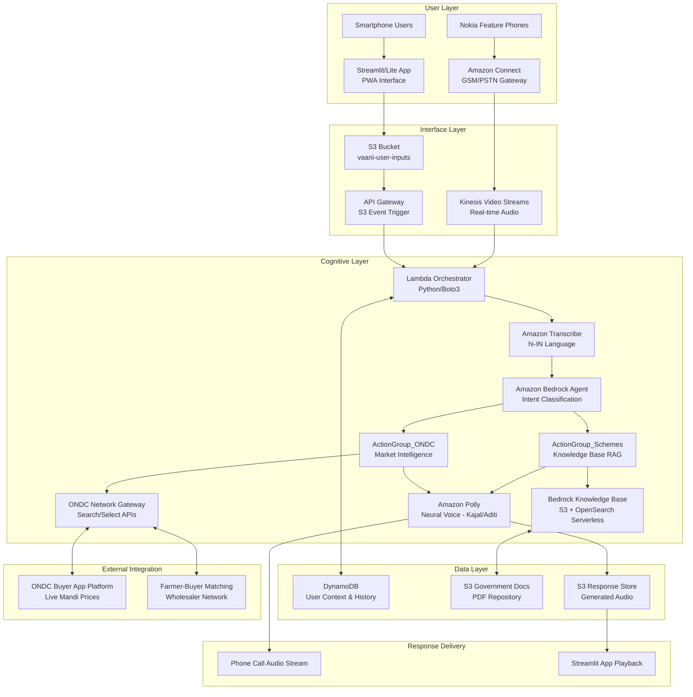
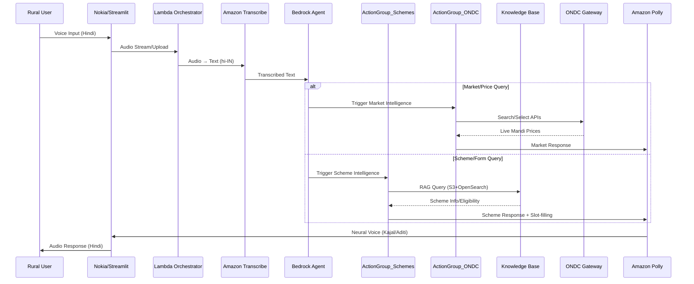

# Design Document: Vaani-Sahayak

## Overview

Vaani-Sahayak is a hybrid omni-channel voice assistant designed specifically for rural India, implementing a "Write Once, Serve Everyone" architecture built on three core pillars. The system serves users through Nokia feature phones via GSM/PSTN telephony (Amazon Connect) and smartphones via a Streamlit/Lite App. The unified backend leverages Amazon Bedrock Agent with specialized Action Groups for intelligent scheme assistance (RAG-based) and real-time ONDC market intelligence, providing contextually aware responses in Hindi with an empathetic "Gram-Didi" persona.

The system architecture emphasizes accessibility, reliability, and cost-effectiveness for rural users with varying levels of technology access and connectivity constraints, while delivering advanced AI capabilities through AWS services and ONDC network integration.

## Three-Pillar Architecture

### Pillar 1: Hybrid Interface
- **GSM/PSTN Telephony**: Amazon Connect for Nokia feature phones with real-time audio streaming
- **Streamlit/Lite App**: Progressive Web App for smartphones with optimized data usage
- **Universal Voice Entry**: Seamless speech-to-text processing regardless of device type

### Pillar 2: Scheme Intelligence (RAG)
- **Bedrock Knowledge Bases**: S3 + OpenSearch Serverless for government PDF documents
- **ActionGroup_Schemes**: Specialized action group for scheme eligibility and auto-enrollment
- **Intelligent Slot-filling**: Automated form generation and application assistance

### Pillar 3: ONDC Market Intelligence
- **ONDC Buyer App (BAP)**: Certified integration with ONDC Network Gateways
- **ActionGroup_ONDC**: Real-time price discovery and farmer-buyer matching
- **Live Market Data**: Search/Select protocols for current Mandi prices and buyer listings

## Architecture

### High-Level Architecture



### Integrated Data Flow



### Core Design Principles

1. **Three-Pillar Integration**: Hybrid interface + Scheme intelligence + ONDC market intelligence
2. **Channel Agnostic Processing**: Single backend handles both Nokia phones and smartphones
3. **Context Preservation**: User profiles and conversation history maintained across scheme and market interactions
4. **Real-time Intelligence**: Live ONDC market data and RAG-based scheme information
5. **Rural-First Design**: Optimized for low bandwidth, intermittent connectivity, and varying device capabilities
6. **Privacy by Design**: Automatic data cleanup, minimal data retention, and secure ONDC integration

## Components and Interfaces

### 1. User Input Channels

#### PSTN Channel (Feature Phones)
- **Service**: Amazon Connect
- **Input Flow**: 
  - User dials toll-free number
  - Amazon Connect answers and establishes session
  - Audio streams to Kinesis Video Streams in real-time chunks
  - Triggers Lambda Orchestrator for immediate processing

**Interface Specification**:
```python
# Kinesis Video Stream Event Structure
{
    "Records": [{
        "kinesis": {
            "data": "base64_encoded_audio_chunk",
            "sequenceNumber": "sequence_id",
            "partitionKey": "phone_number"
        },
        "eventSource": "aws:kinesis",
        "eventName": "aws:kinesis:record"
    }]
}
```

#### Streamlit Channel (Smartphones)
- **Service**: Streamlit/Lite App PWA
- **Input Flow**:
  - User records audio in Streamlit interface
  - App compresses to Opus/MP3 format for data efficiency
  - Direct upload to S3 using presigned URLs
  - S3 event triggers API Gateway → Lambda Orchestrator

**Interface Specification**:
```python
# S3 Event Structure
{
    "Records": [{
        "s3": {
            "bucket": {"name": "vaani-user-inputs"},
            "object": {
                "key": "audio_files/{phone_number}/{timestamp}.opus",
                "size": 12345
            }
        },
        "eventSource": "aws:s3",
        "eventName": "ObjectCreated:Put"
    }]
}
```

### 2. Lambda Orchestrator with Bedrock Agent Integration

The central processing unit that coordinates all system components and manages the Bedrock Agent with specialized Action Groups.

**Core Functions**:
```python
class VaaniOrchestrator:
    def lambda_handler(self, event, context):
        """Main entry point for all audio processing"""
        input_source = self.detect_input_source(event)
        
        if input_source == "kinesis":
            return self.process_streaming_audio(event)
        elif input_source == "s3":
            return self.process_uploaded_audio(event)
    
    def detect_input_source(self, event):
        """Determine if input is from Kinesis (Nokia) or S3 (Streamlit)"""
        if "Records" in event and event["Records"][0].get("eventSource") == "aws:kinesis":
            return "kinesis"
        elif "Records" in event and event["Records"][0].get("eventSource") == "aws:s3":
            return "s3"
        
    def process_streaming_audio(self, event):
        """Handle real-time audio from Nokia phone calls"""
        # Extract audio chunk from Kinesis
        # Accumulate chunks until speech pause detected
        # Process through Bedrock Agent pipeline
        
    def process_uploaded_audio(self, event):
        """Handle uploaded audio files from Streamlit app"""
        # Download audio file from S3
        # Process through Bedrock Agent pipeline
        # Generate and store response
        
    def invoke_bedrock_agent(self, transcribed_text, user_context):
        """Invoke Bedrock Agent with intent classification"""
        # Send text to Bedrock Agent
        # Agent classifies intent and triggers appropriate Action Group
        # Returns response from ActionGroup_Schemes or ActionGroup_ONDC
```

**Processing Pipeline**:
1. **Input Detection**: Identify source channel (Nokia/Streamlit) and extract audio data
2. **User Context Retrieval**: Load user profile and conversation history from DynamoDB
3. **Speech-to-Text**: Transcribe audio using Amazon Transcribe (hi-IN)
4. **Bedrock Agent Processing**: 
   - Intent classification (Market/Price vs Scheme/Form)
   - Action Group selection and execution
   - Response generation with Gram-Didi persona
5. **Text-to-Speech**: Convert response to audio using Amazon Polly
6. **Response Delivery**: Route audio back through appropriate channel
7. **Context Update**: Store conversation and interaction type in DynamoDB

### 3. Bedrock Agent with Specialized Action Groups

#### Amazon Bedrock Agent Configuration
```python
bedrock_agent_config = {
    "agentName": "vaani-sahayak-agent",
    "agentResourceRoleArn": "arn:aws:iam::account:role/VaaniBedrockAgentRole",
    "foundationModel": "amazon.titan-text-express-v1",
    "instruction": """
    You are Gram-Didi, an empathetic rural village sister helping farmers and villagers in India.
    You have access to two specialized capabilities:
    1. Government scheme information and application assistance
    2. Real-time market prices and buyer connections through ONDC
    
    Always respond in simple, warm Hindi and provide practical advice.
    Classify user intent and use appropriate action groups for assistance.
    """,
    "actionGroups": [
        {
            "actionGroupName": "ActionGroup_Schemes",
            "description": "Handle government scheme queries and application assistance",
            "actionGroupExecutor": {
                "lambda": "arn:aws:lambda:region:account:function:schemes-action-group"
            },
            "knowledgeBases": [
                {
                    "knowledgeBaseId": "scheme-knowledge-base-id",
                    "description": "Government PDF documents and eligibility criteria"
                }
            ]
        },
        {
            "actionGroupName": "ActionGroup_ONDC",
            "description": "Handle market price queries and buyer matching",
            "actionGroupExecutor": {
                "lambda": "arn:aws:lambda:region:account:function:ondc-action-group"
            }
        }
    ]
}
```

#### ActionGroup_Schemes Implementation
```python
class SchemesActionGroup:
    def lambda_handler(self, event, context):
        """Handle scheme-related queries and applications"""
        action = event.get('actionGroup')
        function = event.get('function')
        
        if function == "search_schemes":
            return self.search_government_schemes(event['parameters'])
        elif function == "check_eligibility":
            return self.check_scheme_eligibility(event['parameters'])
        elif function == "start_application":
            return self.initiate_scheme_application(event['parameters'])
        elif function == "collect_application_data":
            return self.slot_filling_process(event['parameters'])
    
    def search_government_schemes(self, parameters):
        """Query Knowledge Base for relevant schemes"""
        # Use Bedrock Knowledge Base to retrieve scheme information
        # Filter by user location, crop type, and eligibility criteria
        
    def initiate_scheme_application(self, parameters):
        """Start intelligent slot-filling for scheme application"""
        # Begin collecting required information step by step
        # Generate pre-filled forms and store in S3
```

#### ActionGroup_ONDC Implementation
```python
class ONDCActionGroup:
    def lambda_handler(self, event, context):
        """Handle ONDC market intelligence queries"""
        action = event.get('actionGroup')
        function = event.get('function')
        
        if function == "get_mandi_prices":
            return self.fetch_live_mandi_prices(event['parameters'])
        elif function == "search_buyers":
            return self.search_crop_buyers(event['parameters'])
        elif function == "connect_buyer":
            return self.facilitate_buyer_connection(event['parameters'])
    
    def fetch_live_mandi_prices(self, parameters):
        """Query ONDC Network for real-time prices"""
        # Use ONDC Search API to get current Mandi prices
        # Filter by crop type, location, and quality parameters
        
    def search_crop_buyers(self, parameters):
        """Find potential buyers through ONDC"""
        # Use ONDC Search API to find buyers/wholesalers
        # Match based on crop type, quantity, and location
        
    def facilitate_buyer_connection(self, parameters):
        """Connect farmer with buyer via ONDC Select API"""
        # Use ONDC Select API to establish buyer-farmer connection
        # Handle negotiation and transaction facilitation
```

### 4. Knowledge Base and ONDC Integration

#### Bedrock Knowledge Base Configuration
```python
knowledge_base_config = {
    "name": "government-schemes-kb",
    "description": "Government scheme documents and eligibility criteria",
    "roleArn": "arn:aws:iam::account:role/BedrockKnowledgeBaseRole",
    "knowledgeBaseConfiguration": {
        "type": "VECTOR",
        "vectorKnowledgeBaseConfiguration": {
            "embeddingModelArn": "arn:aws:bedrock:region::foundation-model/amazon.titan-embed-text-v1"
        }
    },
    "storageConfiguration": {
        "type": "OPENSEARCH_SERVERLESS",
        "opensearchServerlessConfiguration": {
            "collectionArn": "arn:aws:aoss:region:account:collection/schemes-collection",
            "vectorIndexName": "schemes-index",
            "fieldMapping": {
                "vectorField": "vector",
                "textField": "text",
                "metadataField": "metadata"
            }
        }
    }
}
```

#### ONDC Network Gateway Integration
```python
class ONDCConnector:
    def __init__(self):
        self.base_url = "https://ondc-network-gateway.com/api/v1"
        self.subscriber_id = "vaani-sahayak-bap"
        self.subscriber_uri = "https://vaani-sahayak.com/ondc/webhook"
    
    def search_products(self, search_params):
        """Search for products/prices using ONDC Search API"""
        search_request = {
            "context": {
                "domain": "nic2004:01110",  # Agriculture domain
                "country": "IND",
                "city": search_params.get("city"),
                "action": "search",
                "version": "1.1.0",
                "bap_id": self.subscriber_id,
                "bap_uri": self.subscriber_uri
            },
            "message": {
                "intent": {
                    "item": {
                        "descriptor": {
                            "name": search_params.get("crop_name")
                        }
                    },
                    "fulfillment": {
                        "type": "Delivery",
                        "start": {
                            "location": {
                                "gps": search_params.get("farmer_location")
                            }
                        }
                    }
                }
            }
        }
        return self.make_ondc_request("/search", search_request)
    
    def select_offer(self, select_params):
        """Select a specific offer using ONDC Select API"""
        select_request = {
            "context": {
                "domain": "nic2004:01110",
                "action": "select",
                "version": "1.1.0",
                "bap_id": self.subscriber_id,
                "bap_uri": self.subscriber_uri
            },
            "message": {
                "order": {
                    "provider": select_params.get("provider"),
                    "items": select_params.get("items"),
                    "fulfillments": select_params.get("fulfillments")
                }
            }
        }
        return self.make_ondc_request("/select", select_request)
```

### 5. Speech Processing Services

#### Amazon Transcribe Configuration
```python
transcribe_config = {
    "LanguageCode": "hi-IN",
    "MediaFormat": "opus",  # or "mp3" for Streamlit uploads
    "MediaSampleRateHertz": 16000,
    "Settings": {
        "ShowSpeakerLabels": False,
        "MaxSpeakerLabels": 1,
        "VocabularyName": "rural-hindi-agricultural-vocabulary"  # Custom vocabulary
    }
}
```

#### Amazon Polly Configuration
```python
polly_config = {
    "Engine": "neural",
    "LanguageCode": "hi-IN",
    "VoiceId": "Kajal",  # Primary choice, fallback to "Aditi"
    "OutputFormat": "mp3",
    "SampleRate": "16000",
    "TextType": "text"
}
```

### 6. Data Storage Layer

#### DynamoDB Schema
```python
# Table: vaani-user-context
{
    "TableName": "vaani-user-context",
    "KeySchema": [
        {"AttributeName": "phone_number", "KeyType": "HASH"}
    ],
    "AttributeDefinitions": [
        {"AttributeName": "phone_number", "AttributeType": "S"}
    ],
    "BillingMode": "PAY_PER_REQUEST"
}

# Item Structure
user_context_item = {
    "phone_number": "+91XXXXXXXXXX",
    "user_profile": {
        "name": "राम कुमार",
        "crop_type": "wheat",
        "language": "hi-IN",
        "location": "UP",
        "farm_size": "2_acres",
        "created_at": "2024-01-15T10:30:00Z"
    },
    "conversation_history": [
        {
            "timestamp": "2024-01-15T10:30:00Z",
            "user_input": "गेहूं का भाव क्या है?",
            "assistant_response": "राम जी, आज गेहूं का भाव ₹2,100 प्रति क्विंटल है...",
            "session_id": "session_123",
            "interaction_type": "market_query",
            "action_group_used": "ActionGroup_ONDC"
        },
        {
            "timestamp": "2024-01-15T11:00:00Z",
            "user_input": "PM-KISAN योजना के लिए आवेदन कैसे करें?",
            "assistant_response": "राम जी, PM-KISAN योजना के लिए आपको ये दस्तावेज चाहिए...",
            "session_id": "session_124",
            "interaction_type": "scheme_query",
            "action_group_used": "ActionGroup_Schemes"
        }
    ],
    "scheme_applications": [
        {
            "scheme_name": "PM-KISAN",
            "application_status": "in_progress",
            "form_s3_url": "s3://vaani-forms/ram-kumar/pm-kisan-form.pdf",
            "collected_data": {
                "aadhaar": "XXXX-XXXX-1234",
                "bank_account": "XXXX-XXXX-5678",
                "land_records": "pending"
            }
        }
    ],
    "market_preferences": {
        "preferred_buyers": ["buyer_123", "buyer_456"],
        "price_alerts": {
            "wheat": {"min_price": 2000, "max_price": 2500}
        }
    },
    "last_interaction": "2024-01-15T11:00:00Z",
    "total_interactions": 15
}
```

#### S3 Bucket Structure
```
vaani-user-inputs/
├── audio_files/
│   └── {phone_number}/
│       └── {timestamp}.opus
├── response_audio/
│   └── {phone_number}/
│       └── {session_id}_response.mp3
├── government_documents/
│   ├── schemes/
│   │   ├── pm-kisan/
│   │   ├── crop-insurance/
│   │   └── fertilizer-subsidy/
│   └── eligibility_criteria/
└── generated_forms/
    └── {phone_number}/
        ├── pm-kisan-application.pdf
        └── crop-insurance-form.pdf

vaani-knowledge-base/
├── scheme_documents/
│   ├── pm-kisan-guidelines.pdf
│   ├── crop-insurance-policy.pdf
│   └── fertilizer-subsidy-rules.pdf
└── processed_embeddings/
    └── vector_store/

Lifecycle Policies: 
- Audio files: Delete after 24 hours
- Generated forms: Delete after 30 days
- Knowledge base documents: Retain indefinitely
```

## Data Models

### Core Data Structures

```python
from dataclasses import dataclass
from typing import List, Optional
from datetime import datetime

@dataclass
class UserProfile:
    name: str
    phone_number: str
    crop_type: Optional[str] = None
    language: str = "hi-IN"
    location: Optional[str] = None
    farm_size: Optional[str] = None
    created_at: datetime = datetime.now()

@dataclass
class ConversationEntry:
    timestamp: datetime
    user_input: str
    assistant_response: str
    session_id: str
    interaction_type: str  # "market_query", "scheme_query", "general"
    action_group_used: Optional[str] = None
    confidence_score: Optional[float] = None

@dataclass
class SchemeApplication:
    scheme_name: str
    application_status: str  # "in_progress", "submitted", "approved", "rejected"
    form_s3_url: Optional[str] = None
    collected_data: Dict[str, Any] = None
    created_at: datetime = datetime.now()

@dataclass
class MarketQuery:
    crop_name: str
    query_type: str  # "price_check", "buyer_search", "market_trends"
    location: str
    quantity: Optional[str] = None
    quality_grade: Optional[str] = None
    timestamp: datetime = datetime.now()

@dataclass
class ONDCResponse:
    search_results: List[Dict[str, Any]]
    selected_offers: List[Dict[str, Any]]
    buyer_connections: List[Dict[str, Any]]
    timestamp: datetime = datetime.now()

@dataclass
class AudioInput:
    source_channel: str  # "nokia_pstn" or "streamlit_app"
    phone_number: str
    audio_data: bytes
    format: str  # "opus", "mp3", "wav"
    duration_seconds: float
    session_id: str

@dataclass
class ProcessingResult:
    transcribed_text: str
    intent_classification: str  # "market_query", "scheme_query", "general"
    action_group_used: str  # "ActionGroup_ONDC", "ActionGroup_Schemes"
    generated_response: str
    audio_response_url: Optional[str] = None
    confidence_score: float = 0.0
    processing_time_ms: int = 0
    error_message: Optional[str] = None

@dataclass
class SystemMetrics:
    total_calls_today: int
    total_streamlit_sessions: int
    average_response_time_ms: float
    transcription_accuracy: float
    scheme_queries_count: int
    market_queries_count: int
    successful_ondc_connections: int
    user_satisfaction_score: float
```

### Error Handling Models

```python
@dataclass
class VaaniError:
    error_code: str
    error_message: str
    user_friendly_message: str
    retry_count: int = 0
    timestamp: datetime = datetime.now()

# Common Error Types
class ErrorCodes:
    TRANSCRIPTION_FAILED = "TRANS_001"
    BEDROCK_AGENT_UNAVAILABLE = "AGENT_001"
    ACTION_GROUP_FAILED = "AG_001"
    KNOWLEDGE_BASE_ERROR = "KB_001"
    ONDC_API_ERROR = "ONDC_001"
    POLLY_FAILED = "TTS_001"
    NETWORK_TIMEOUT = "NET_001"
    INVALID_AUDIO = "AUDIO_001"
    USER_CONTEXT_ERROR = "CTX_001"
    SCHEME_APPLICATION_ERROR = "SCHEME_001"
```

## Correctness Properties

*A property is a characteristic or behavior that should hold true across all valid executions of a system—essentially, a formal statement about what the system should do. Properties serve as the bridge between human-readable specifications and machine-verifiable correctness guarantees.*

Before defining the correctness properties, let me analyze the acceptance criteria to determine which ones are testable as properties.

Based on the prework analysis, I'll now define the key correctness properties that validate the system's behavior:

### Property 1: Multi-Channel Audio Processing
*For any* audio input from either Nokia PSTN or Streamlit channels, the Orchestrator should correctly detect the input source and route it through the appropriate processing pipeline while maintaining the same backend logic.
**Validates: Requirements 1.1, 1.2, 1.3, 1.4, 1.5**

### Property 2: Bedrock Agent Pipeline Execution
*For any* valid audio input, the system should execute the complete processing pipeline (Transcribe → Bedrock Agent → Action Group Selection → Response Generation → Polly) in the correct sequence with proper service configurations (hi-IN language, Gram-Didi persona, Kajal/Aditi voice).
**Validates: Requirements 2.1, 2.2, 6.1, 6.2, 7.1, 7.2, 7.3**

### Property 3: Intent Classification and Action Group Routing
*For any* transcribed user query, the Bedrock Agent should correctly classify the intent as either 'Market/Price' or 'Scheme/Form' and trigger the appropriate Action Group (ActionGroup_ONDC or ActionGroup_Schemes) for processing.
**Validates: Requirements 5.1, 5.2, 5.3, 5.4, 5.5**

### Property 4: Scheme Intelligence with RAG
*For any* scheme-related query, the ActionGroup_Schemes should query the Bedrock Knowledge Base, retrieve accurate information from government PDF documents, and when applicable, initiate intelligent slot-filling for application assistance.
**Validates: Requirements 3.1, 3.2, 3.3, 3.4, 3.5**

### Property 5: ONDC Market Intelligence
*For any* market-related query, the ActionGroup_ONDC should query ONDC Network Gateways for real-time Mandi prices, search for buyers when requested, and facilitate connections using ONDC search/select protocols.
**Validates: Requirements 4.1, 4.2, 4.3, 4.4, 4.5**

### Property 6: User Context Lifecycle Management
*For any* user interaction, the system should properly manage the complete user context lifecycle: identification by phone number, profile creation for new users, data storage with interaction type tracking, and conversation history updates across both scheme and market queries.
**Validates: Requirements 8.1, 8.2, 8.3, 8.4, 8.5**

### Property 7: Channel-Specific Response Delivery
*For any* generated audio response, the system should deliver it through the appropriate channel (streaming for Nokia PSTN, presigned URL for Streamlit) within acceptable latency limits and with proper error handling.
**Validates: Requirements 9.1, 9.2, 9.4, 9.5**

### Property 8: Comprehensive Error Handling
*For any* service failure or processing error (including Bedrock Agent, Action Groups, Knowledge Base, or ONDC API failures), the system should implement appropriate error handling, retry mechanisms, user-friendly feedback, and graceful degradation while maintaining system stability.
**Validates: Requirements 2.3, 2.4, 4.5, 6.5, 12.4, 13.1, 13.2, 13.3, 13.4, 13.5**

### Property 9: Security and Privacy Compliance
*For any* user data and system interaction, the system should enforce security measures including data encryption, minimal IAM permissions, PII protection, lifecycle policies for data deletion, and secure data transmission with ONDC gateways.
**Validates: Requirements 11.1, 11.2, 11.3, 11.4, 11.5**

### Property 10: Event-Driven Architecture Consistency
*For any* system event (S3 upload from Streamlit, Kinesis stream from Nokia calls), the system should properly trigger the orchestrator and maintain consistent processing logic regardless of the input channel or event source.
**Validates: Requirements 12.1, 12.2, 12.3, 12.5**

## Error Handling

### Error Categories and Responses

#### 1. Audio Processing Errors
- **Transcription Failures**: Retry with adjusted parameters, request user to repeat
- **Invalid Audio Format**: Convert or request re-recording with guidance
- **Audio Quality Issues**: Attempt processing, provide feedback if unsuccessful

#### 2. Bedrock Agent and Action Group Errors
- **Bedrock Agent Unavailability**: Implement exponential backoff retry, provide user-friendly error messages
- **Action Group Failures**: Fallback to alternative processing, log detailed error information
- **Intent Classification Errors**: Ask clarifying questions to determine appropriate action group
- **Knowledge Base Query Failures**: Retry with simplified queries, provide cached responses when available

#### 3. ONDC Integration Errors
- **ONDC API Unavailability**: Provide cached market data, inform users of temporary service disruption
- **Network Gateway Timeouts**: Retry with exponential backoff, offer alternative market information sources
- **Authentication Failures**: Refresh ONDC credentials, log security events for investigation
- **Search/Select API Errors**: Provide fallback market data, suggest direct contact alternatives

#### 4. Scheme Processing Errors
- **Knowledge Base Retrieval Failures**: Retry with alternative search terms, provide general scheme information
- **Slot-filling Process Errors**: Resume from last successful step, provide clear guidance for missing information
- **Form Generation Failures**: Retry form creation, offer manual application guidance
- **S3 Document Storage Errors**: Retry upload, provide alternative document delivery methods

#### 5. User Context and Storage Errors
- **DynamoDB Failures**: Retry with backoff, operate in degraded mode without context
- **Profile Corruption**: Recreate profile, log incident for investigation
- **Session Management**: Maintain session state, recover from interruptions
- **S3 Storage Errors**: Retry with exponential backoff, provide alternative storage options

#### 6. Network and Connectivity Errors
- **Nokia Call Disconnections**: Attempt session recovery, provide callback options
- **Streamlit Upload Failures**: Retry with exponential backoff, provide progress feedback
- **Timeout Handling**: Graceful timeout with user notification and retry options

### Error Response Templates

```python
error_responses = {
    "transcription_failed": "माफ करें, मैं आपकी बात समझ नहीं पाई। कृपया फिर से बोलें।",
    "bedrock_agent_unavailable": "अभी सिस्टम में कुछ समस्या है। कृपया थोड़ी देर बाद कोशिश करें।",
    "ondc_service_down": "बाज़ार की जानकारी अभी उपलब्ध नहीं है। कृपया बाद में कोशिश करें।",
    "scheme_info_unavailable": "योजना की जानकारी अभी नहीं मिल पा रही। कृपया बाद में पूछें।",
    "audio_quality_poor": "आवाज साफ नहीं आई। कृपया फोन को मुंह के पास रखकर फिर से बोलें।",
    "network_issue": "नेटवर्क की समस्या है। कृपया कुछ देर बाद कॉल करें।",
    "intent_unclear": "मैं समझ नहीं पाई कि आप बाज़ार के बारे में पूछ रहे हैं या योजना के बारे में। कृपया स्पष्ट करें।",
    "form_generation_failed": "आवेदन फॉर्म बनाने में समस्या हुई। कृपया दोबारा कोशिश करें।"
}
```

## Testing Strategy

### Dual Testing Approach

The system requires both unit testing and property-based testing for comprehensive coverage:

**Unit Tests**: Focus on specific examples, edge cases, and integration points
- Service integration tests for AWS components
- Error condition handling with specific scenarios  
- Audio format validation and conversion
- User profile creation and retrieval
- Channel-specific response delivery mechanisms

**Property-Based Tests**: Verify universal properties across all inputs
- Multi-channel audio processing with randomized inputs
- Service pipeline execution with various audio samples
- Context management across different user scenarios
- Error handling with simulated failure conditions
- Security compliance across all data operations

### Property-Based Testing Configuration

**Testing Framework**: Use `hypothesis` for Python-based property testing
**Test Configuration**: Minimum 100 iterations per property test
**Test Tagging**: Each property test must reference its design document property

Example test structure:
```python
@given(audio_input=audio_strategy(), channel=sampled_from(['pstn', 'web']))
def test_multi_channel_processing(audio_input, channel):
    """
    Feature: vaani-sahayak, Property 1: Multi-Channel Audio Processing
    For any audio input from either PSTN or web channels, the Orchestrator 
    should correctly detect the input source and route it appropriately.
    """
    result = orchestrator.process_audio(audio_input, channel)
    assert result.channel_detected == channel
    assert result.processing_pipeline_executed
    assert result.backend_logic_consistent
```

### Integration Testing

**End-to-End Scenarios**:
1. Complete phone call flow from dial to response
2. Web app audio upload to response playback
3. Multi-turn conversations with context preservation
4. Error recovery and graceful degradation
5. Cross-channel user experience consistency

**Performance Testing**:
- Response latency under various load conditions
- Concurrent user handling capacity
- Audio processing throughput
- Database query performance
- AWS service integration reliability

### Security Testing

**Data Protection Validation**:
- PII handling and encryption verification
- IAM role permission auditing
- Data lifecycle policy enforcement
- Secure transmission protocol validation
- Access logging and monitoring

**Penetration Testing**:
- Audio injection attack prevention
- API endpoint security validation
- Authentication and authorization testing
- Data exfiltration prevention
- Service abuse protection

## Implementation Notes

### AWS Service Limits and Considerations

1. **Amazon Connect**: 
   - Concurrent call limits based on service quotas
   - Audio quality optimization for Nokia feature phones and rural networks
   - Cost optimization through efficient call routing and session management

2. **Amazon Transcribe**:
   - Real-time vs batch processing trade-offs for Nokia vs Streamlit channels
   - Custom vocabulary for agricultural terms and rural Hindi dialects
   - Language model adaptation for scheme-specific terminology

3. **Amazon Bedrock Agent**:
   - Token limits and cost management for agent interactions
   - Action Group execution limits and timeout handling
   - Model selection based on response quality vs cost for intent classification

4. **Bedrock Knowledge Bases**:
   - Vector embedding limits for government document processing
   - OpenSearch Serverless scaling for concurrent scheme queries
   - Document ingestion and indexing optimization for PDF processing

5. **ONDC Network Integration**:
   - API rate limits and quota management for search/select operations
   - Network gateway availability and failover mechanisms
   - Authentication token refresh and security compliance

6. **Amazon Polly**:
   - Voice consistency across sessions and channels
   - Audio format optimization for Nokia phones vs smartphone speakers
   - Caching strategies for common responses in both scheme and market domains

7. **DynamoDB**:
   - Partition key design for optimal performance with phone number-based access
   - Global secondary indexes for query patterns across interaction types
   - Auto-scaling configuration for variable load from both channels

### Deployment and Monitoring

**Infrastructure as Code**: Use AWS CDK or CloudFormation for reproducible deployments
**Monitoring**: CloudWatch metrics, X-Ray tracing, custom dashboards for rural-specific KPIs
**Alerting**: Proactive alerts for service degradation, error rate spikes, and user experience issues
**Logging**: Structured logging with correlation IDs for end-to-end request tracking

### Rural-Specific Optimizations

1. **Network Resilience**: Retry mechanisms optimized for intermittent connectivity in rural areas
2. **Audio Compression**: Optimized for low-bandwidth transmission between Nokia phones and Streamlit apps
3. **Response Caching**: Common scheme and market responses cached to reduce processing time and costs
4. **Offline Capability**: Streamlit PWA features for limited offline functionality when network is unavailable
5. **Cost Optimization**: Efficient resource usage to keep service affordable for rural users
6. **Multi-language Support**: Hindi language optimization with rural dialect understanding
7. **Device Compatibility**: Optimized audio processing for both Nokia feature phones and basic smartphones
8. **Data Usage Minimization**: Compressed audio formats and efficient data transfer for limited data plans

This design provides a robust, scalable, and user-friendly voice assistant specifically tailored for rural India's unique technological and social context, integrating government scheme assistance with real-time market intelligence through a unified three-pillar architecture.