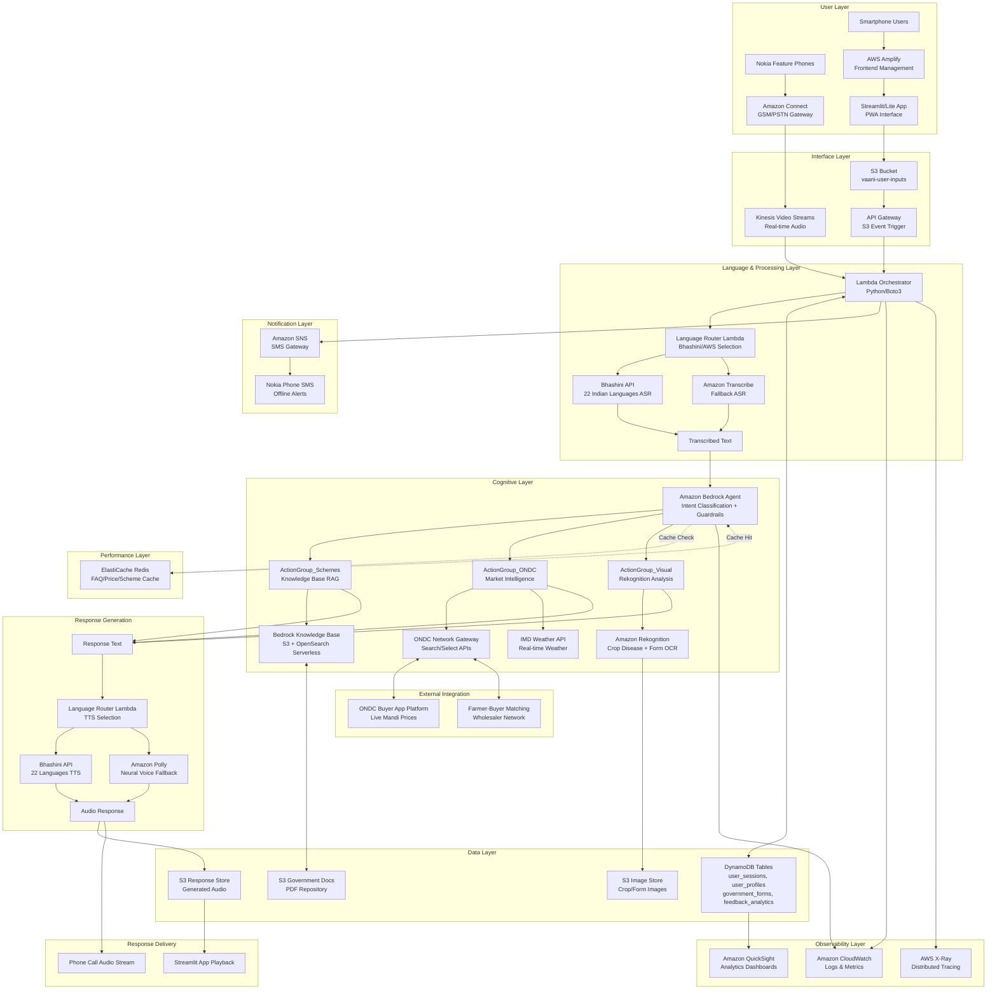
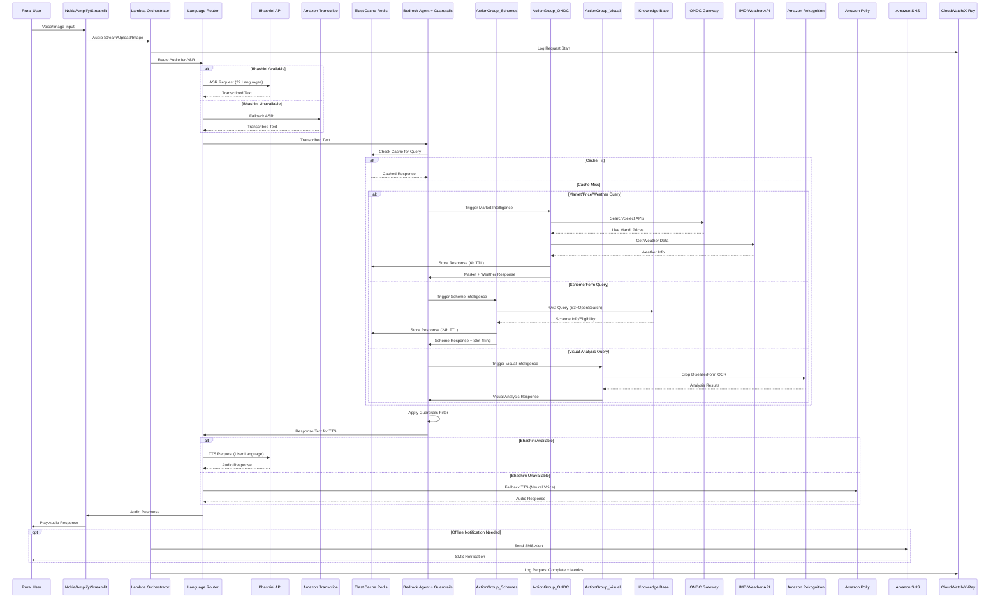

# Design Document: Vaani-Sahayak

## Overview

Vaani-Sahayak is an enterprise-grade hybrid omni-channel voice assistant designed specifically for rural India, implementing a "Write Once, Serve Everyone" architecture built on three core pillars with advanced performance, intelligence, and observability capabilities. The system serves users through Nokia feature phones via GSM/PSTN telephony (Amazon Connect) and smartphones via a Streamlit/Lite App managed by AWS Amplify. 

The unified backend leverages Amazon Bedrock Agent with specialized Action Groups for intelligent scheme assistance (RAG-based), real-time ONDC market intelligence, and visual intelligence for crop disease detection and form OCR. The system provides contextually aware responses in 22 Indian languages through intelligent routing between Bhashini API and AWS services, maintaining an empathetic "Gram-Didi" persona.

The architecture emphasizes accessibility, reliability, performance optimization through Redis caching, content safety via Bedrock Guardrails, and comprehensive observability through CloudWatch, X-Ray, and QuickSight. It integrates real-time weather data from IMD and provides offline notifications via SMS for Nokia phone users, while maintaining cost-effectiveness for rural users with varying levels of technology access and connectivity constraints.

## Three-Pillar Architecture

### Pillar 1: Hybrid Interface with Unified Entry Layer
- **AWS Amplify**: Frontend management for web and mobile entry points with authentication and state sync
- **GSM/PSTN Telephony**: Amazon Connect for Nokia feature phones with real-time audio streaming
- **Streamlit/Lite App**: Progressive Web App for smartphones with optimized data usage
- **Language Router**: Intelligent routing between Bhashini API (22 languages) and AWS Transcribe/Polly
- **Universal Voice Entry**: Seamless multilingual speech-to-text processing regardless of device type

### Pillar 2: Scheme Intelligence (RAG) with Visual Intelligence
- **Bedrock Knowledge Bases**: S3 + OpenSearch Serverless for government PDF documents
- **ActionGroup_Schemes**: Specialized action group for scheme eligibility and auto-enrollment
- **ActionGroup_Visual**: Crop disease detection and form OCR using Amazon Rekognition
- **Intelligent Slot-filling**: Automated form generation and application assistance
- **Bedrock Guardrails**: Content safety and rural sensitivity filtering

### Pillar 3: ONDC Market Intelligence with Real-time Data
- **ONDC Buyer App (BAP)**: Certified integration with ONDC Network Gateways
- **ActionGroup_ONDC**: Real-time price discovery and farmer-buyer matching
- **IMD Weather Integration**: Live weather data and agricultural advisories
- **ElastiCache Layer**: Redis caching for market prices (6h TTL) and scheme data (24h TTL)
- **Live Market Data**: Search/Select protocols for current Mandi prices and buyer listings

### Cross-Cutting Capabilities
- **Performance**: ElastiCache (Redis) for caching FAQs, market prices, and scheme details
- **Notifications**: Amazon SNS for offline SMS alerts to Nokia phone users
- **Observability**: CloudWatch (logging), X-Ray (tracing), QuickSight (analytics)
- **Data Persistence**: Enhanced DynamoDB schema with user_sessions, government_forms, user_profiles, feedback_analytics

## Architecture

### High-Level Architecture


```mermaid
graph TB
    subgraph "User Layer"
        A[Nokia Feature Phones] --> B[Amazon Connect<br/>GSM/PSTN Gateway]
        C[Smartphone Users] --> D[AWS Amplify<br/>Frontend Management]
        D --> E[Streamlit/Lite App<br/>PWA Interface]
    end
    
    subgraph "Interface Layer"
        B --> F[Kinesis Video Streams<br/>Real-time Audio]
        E --> G[S3 Bucket<br/>vaani-user-inputs]
        G --> H[API Gateway<br/>S3 Event Trigger]
    end
    
    subgraph "Language & Processing Layer"
        F --> I[Lambda Orchestrator<br/>Python/Boto3]
        H --> I
        I --> J[Language Router Lambda<br/>Bhashini/AWS Selection]
        J --> K[Bhashini API<br/>22 Indian Languages ASR]
        J --> L[Amazon Transcribe<br/>Fallback ASR]
        K --> M[Transcribed Text]
        L --> M
    end
    
    subgraph "Cognitive Layer"
        M --> N[Amazon Bedrock Agent<br/>Intent Classification + Guardrails]
        
        N --> O[ActionGroup_Schemes<br/>Knowledge Base RAG]
        N --> P[ActionGroup_ONDC<br/>Market Intelligence]
        N --> Q[ActionGroup_Visual<br/>Rekognition Analysis]
        
        O --> R[Bedrock Knowledge Base<br/>S3 + OpenSearch Serverless]
        P --> S[ONDC Network Gateway<br/>Search/Select APIs]
        P --> T[IMD Weather API<br/>Real-time Weather]
        Q --> U[Amazon Rekognition<br/>Crop Disease + Form OCR]
    end
    
    subgraph "Performance Layer"
        V[ElastiCache Redis<br/>FAQ/Price/Scheme Cache]
        N -.Cache Check.-> V
        V -.Cache Hit.-> N
    end
    
    subgraph "Response Generation"
        O --> W[Response Text]
        P --> W
        Q --> W
        W --> X[Language Router Lambda<br/>TTS Selection]
        X --> Y[Bhashini API<br/>22 Languages TTS]
        X --> Z[Amazon Polly<br/>Neural Voice Fallback]
        Y --> AA[Audio Response]
        Z --> AA
    end
    
    subgraph "Data Layer"
        I <--> AB[DynamoDB Tables<br/>user_sessions, user_profiles<br/>government_forms, feedback_analytics]
        R <--> AC[S3 Government Docs<br/>PDF Repository]
        AA --> AD[S3 Response Store<br/>Generated Audio]
        U --> AE[S3 Image Store<br/>Crop/Form Images]
    end
    
    subgraph "Response Delivery"
        AA --> AF[Phone Call Audio Stream]
        AD --> AG[Streamlit App Playback]
    end
    
    subgraph "Notification Layer"
        AH[Amazon SNS<br/>SMS Gateway]
        I --> AH
        AH --> AI[Nokia Phone SMS<br/>Offline Alerts]
    end
    
    subgraph "Observability Layer"
        AJ[Amazon CloudWatch<br/>Logs & Metrics]
        AK[AWS X-Ray<br/>Distributed Tracing]
        AL[Amazon QuickSight<br/>Analytics Dashboards]
        
        I --> AJ
        N --> AJ
        I --> AK
        AB --> AL
    end
    
    subgraph "External Integration"
        S <--> AM[ONDC Buyer App Platform<br/>Live Mandi Prices]
        S <--> AN[Farmer-Buyer Matching<br/>Wholesaler Network]
    end
```

### Integrated Data Flow


```mermaid
sequenceDiagram
    participant User as Rural User
    participant Interface as Nokia/Amplify/Streamlit
    participant Orchestrator as Lambda Orchestrator
    participant LangRouter as Language Router
    participant Bhashini as Bhashini API
    participant Transcribe as Amazon Transcribe
    participant Cache as ElastiCache Redis
    participant Agent as Bedrock Agent + Guardrails
    participant Schemes as ActionGroup_Schemes
    participant ONDC as ActionGroup_ONDC
    participant Visual as ActionGroup_Visual
    participant KB as Knowledge Base
    participant Gateway as ONDC Gateway
    participant Weather as IMD Weather API
    participant Rekognition as Amazon Rekognition
    participant Polly as Amazon Polly
    participant SNS as Amazon SNS
    participant Observability as CloudWatch/X-Ray
    
    User->>Interface: Voice/Image Input
    Interface->>Orchestrator: Audio Stream/Upload/Image
    Orchestrator->>Observability: Log Request Start
    Orchestrator->>LangRouter: Route Audio for ASR
    
    alt Bhashini Available
        LangRouter->>Bhashini: ASR Request (22 Languages)
        Bhashini-->>LangRouter: Transcribed Text
    else Bhashini Unavailable
        LangRouter->>Transcribe: Fallback ASR
        Transcribe-->>LangRouter: Transcribed Text
    end
    
    LangRouter->>Agent: Transcribed Text
    Agent->>Cache: Check Cache for Query
    
    alt Cache Hit
        Cache-->>Agent: Cached Response
    else Cache Miss
        alt Market/Price/Weather Query
            Agent->>ONDC: Trigger Market Intelligence
            ONDC->>Gateway: Search/Select APIs
            Gateway-->>ONDC: Live Mandi Prices
            ONDC->>Weather: Get Weather Data
            Weather-->>ONDC: Weather Info
            ONDC->>Cache: Store Response (6h TTL)
            ONDC->>Agent: Market + Weather Response
        else Scheme/Form Query
            Agent->>Schemes: Trigger Scheme Intelligence
            Schemes->>KB: RAG Query (S3+OpenSearch)
            KB-->>Schemes: Scheme Info/Eligibility
            Schemes->>Cache: Store Response (24h TTL)
            Schemes->>Agent: Scheme Response + Slot-filling
        else Visual Analysis Query
            Agent->>Visual: Trigger Visual Intelligence
            Visual->>Rekognition: Crop Disease/Form OCR
            Rekognition-->>Visual: Analysis Results
            Visual->>Agent: Visual Analysis Response
        end
    end
    
    Agent->>Agent: Apply Guardrails Filter
    Agent->>LangRouter: Response Text for TTS
    
    alt Bhashini Available
        LangRouter->>Bhashini: TTS Request (User Language)
        Bhashini-->>LangRouter: Audio Response
    else Bhashini Unavailable
        LangRouter->>Polly: Fallback TTS (Neural Voice)
        Polly-->>LangRouter: Audio Response
    end
    
    LangRouter->>Interface: Audio Response
    Interface->>User: Play Audio Response
    
    opt Offline Notification Needed
        Orchestrator->>SNS: Send SMS Alert
        SNS->>User: SMS Notification
    end
    
    Orchestrator->>Observability: Log Request Complete + Metrics
```

### Core Design Principles

1. **Three-Pillar Integration**: Hybrid interface + Scheme intelligence + ONDC market intelligence
2. **Channel Agnostic Processing**: Single backend handles both Nokia phones and smartphones
3. **Multilingual Support**: 22 Indian languages through intelligent Bhashini/AWS routing
4. **Performance Optimization**: Redis caching for sub-second response times on common queries
5. **Visual Intelligence**: Crop disease detection and form OCR for enhanced user assistance
6. **Content Safety**: Bedrock Guardrails ensuring rural-appropriate and culturally sensitive responses
7. **Context Preservation**: User profiles and conversation history maintained across scheme and market interactions
8. **Real-time Intelligence**: Live ONDC market data, IMD weather, and RAG-based scheme information
9. **Offline Resilience**: SMS notifications for Nokia users without constant connectivity
10. **Rural-First Design**: Optimized for low bandwidth, intermittent connectivity, and varying device capabilities
11. **Comprehensive Observability**: CloudWatch, X-Ray, and QuickSight for monitoring and analytics
12. **Privacy by Design**: Automatic data cleanup, minimal data retention, and secure ONDC integration

## Components and Interfaces

### 1. User Input Channels

#### PSTN Channel (Feature Phones)
- **Service**: Amazon Connect
- **Input Flow**: 
  - User dials toll-free number
  - Amazon Connect answers and establishes session
  - Audio streams to Kinesis Video Streams in real-time chunks
  - Triggers Lambda Orchestrator for immediate processing

**Interface Specification**:
```python
# Kinesis Video Stream Event Structure
{
    "Records": [{
        "kinesis": {
            "data": "base64_encoded_audio_chunk",
            "sequenceNumber": "sequence_id",
            "partitionKey": "phone_number"
        },
        "eventSource": "aws:kinesis",
        "eventName": "aws:kinesis:record"
    }]
}
```

#### Streamlit Channel (Smartphones)
- **Service**: Streamlit/Lite App PWA
- **Input Flow**:
  - User records audio in Streamlit interface
  - App compresses to Opus/MP3 format for data efficiency
  - Direct upload to S3 using presigned URLs
  - S3 event triggers API Gateway → Lambda Orchestrator

**Interface Specification**:
```python
# S3 Event Structure
{
    "Records": [{
        "s3": {
            "bucket": {"name": "vaani-user-inputs"},
            "object": {
                "key": "audio_files/{phone_number}/{timestamp}.opus",
                "size": 12345
            }
        },
        "eventSource": "aws:s3",
        "eventName": "ObjectCreated:Put"
    }]
}
```

### 2. Lambda Orchestrator with Bedrock Agent Integration

The central processing unit that coordinates all system components and manages the Bedrock Agent with specialized Action Groups.

**Core Functions**:
```python
class VaaniOrchestrator:
    def lambda_handler(self, event, context):
        """Main entry point for all audio processing"""
        input_source = self.detect_input_source(event)
        
        if input_source == "kinesis":
            return self.process_streaming_audio(event)
        elif input_source == "s3":
            return self.process_uploaded_audio(event)
    
    def detect_input_source(self, event):
        """Determine if input is from Kinesis (Nokia) or S3 (Streamlit)"""
        if "Records" in event and event["Records"][0].get("eventSource") == "aws:kinesis":
            return "kinesis"
        elif "Records" in event and event["Records"][0].get("eventSource") == "aws:s3":
            return "s3"
        
    def process_streaming_audio(self, event):
        """Handle real-time audio from Nokia phone calls"""
        # Extract audio chunk from Kinesis
        # Accumulate chunks until speech pause detected
        # Process through Bedrock Agent pipeline
        
    def process_uploaded_audio(self, event):
        """Handle uploaded audio files from Streamlit app"""
        # Download audio file from S3
        # Process through Bedrock Agent pipeline
        # Generate and store response
        
    def invoke_bedrock_agent(self, transcribed_text, user_context):
        """Invoke Bedrock Agent with intent classification"""
        # Send text to Bedrock Agent
        # Agent classifies intent and triggers appropriate Action Group
        # Returns response from ActionGroup_Schemes or ActionGroup_ONDC
```

**Processing Pipeline**:
1. **Input Detection**: Identify source channel (Nokia/Streamlit) and extract audio data
2. **User Context Retrieval**: Load user profile and conversation history from DynamoDB
3. **Speech-to-Text**: Transcribe audio using Amazon Transcribe (hi-IN)
4. **Bedrock Agent Processing**: 
   - Intent classification (Market/Price vs Scheme/Form)
   - Action Group selection and execution
   - Response generation with Gram-Didi persona
5. **Text-to-Speech**: Convert response to audio using Amazon Polly
6. **Response Delivery**: Route audio back through appropriate channel
7. **Context Update**: Store conversation and interaction type in DynamoDB

### 3. Bedrock Agent with Specialized Action Groups

#### Amazon Bedrock Agent Configuration
```python
bedrock_agent_config = {
    "agentName": "vaani-sahayak-agent",
    "agentResourceRoleArn": "arn:aws:iam::account:role/VaaniBedrockAgentRole",
    "foundationModel": "amazon.titan-text-express-v1",
    "instruction": """
    You are Gram-Didi, an empathetic rural village sister helping farmers and villagers in India.
    You have access to two specialized capabilities:
    1. Government scheme information and application assistance
    2. Real-time market prices and buyer connections through ONDC
    
    Always respond in simple, warm Hindi and provide practical advice.
    Classify user intent and use appropriate action groups for assistance.
    """,
    "actionGroups": [
        {
            "actionGroupName": "ActionGroup_Schemes",
            "description": "Handle government scheme queries and application assistance",
            "actionGroupExecutor": {
                "lambda": "arn:aws:lambda:region:account:function:schemes-action-group"
            },
            "knowledgeBases": [
                {
                    "knowledgeBaseId": "scheme-knowledge-base-id",
                    "description": "Government PDF documents and eligibility criteria"
                }
            ]
        },
        {
            "actionGroupName": "ActionGroup_ONDC",
            "description": "Handle market price queries and buyer matching",
            "actionGroupExecutor": {
                "lambda": "arn:aws:lambda:region:account:function:ondc-action-group"
            }
        }
    ]
}
```

#### ActionGroup_Schemes Implementation
```python
class SchemesActionGroup:
    def lambda_handler(self, event, context):
        """Handle scheme-related queries and applications"""
        action = event.get('actionGroup')
        function = event.get('function')
        
        if function == "search_schemes":
            return self.search_government_schemes(event['parameters'])
        elif function == "check_eligibility":
            return self.check_scheme_eligibility(event['parameters'])
        elif function == "start_application":
            return self.initiate_scheme_application(event['parameters'])
        elif function == "collect_application_data":
            return self.slot_filling_process(event['parameters'])
    
    def search_government_schemes(self, parameters):
        """Query Knowledge Base for relevant schemes"""
        # Use Bedrock Knowledge Base to retrieve scheme information
        # Filter by user location, crop type, and eligibility criteria
        
    def initiate_scheme_application(self, parameters):
        """Start intelligent slot-filling for scheme application"""
        # Begin collecting required information step by step
        # Generate pre-filled forms and store in S3
```

#### ActionGroup_ONDC Implementation
```python
class ONDCActionGroup:
    def lambda_handler(self, event, context):
        """Handle ONDC market intelligence queries"""
        action = event.get('actionGroup')
        function = event.get('function')
        
        if function == "get_mandi_prices":
            return self.fetch_live_mandi_prices(event['parameters'])
        elif function == "search_buyers":
            return self.search_crop_buyers(event['parameters'])
        elif function == "connect_buyer":
            return self.facilitate_buyer_connection(event['parameters'])
    
    def fetch_live_mandi_prices(self, parameters):
        """Query ONDC Network for real-time prices"""
        # Use ONDC Search API to get current Mandi prices
        # Filter by crop type, location, and quality parameters
        
    def search_crop_buyers(self, parameters):
        """Find potential buyers through ONDC"""
        # Use ONDC Search API to find buyers/wholesalers
        # Match based on crop type, quantity, and location
        
    def facilitate_buyer_connection(self, parameters):
        """Connect farmer with buyer via ONDC Select API"""
        # Use ONDC Select API to establish buyer-farmer connection
        # Handle negotiation and transaction facilitation
```

#### ActionGroup_Visual Implementation
```python
class VisualActionGroup:
    def __init__(self):
        self.rekognition_client = boto3.client('rekognition')
        self.s3_client = boto3.client('s3')
    
    def lambda_handler(self, event, context):
        """Handle visual intelligence queries"""
        action = event.get('actionGroup')
        function = event.get('function')
        
        if function == "detect_crop_disease":
            return self.analyze_crop_image(event['parameters'])
        elif function == "extract_form_data":
            return self.perform_form_ocr(event['parameters'])
    
    def analyze_crop_image(self, parameters):
        """Detect crop diseases using Amazon Rekognition"""
        image_s3_key = parameters.get('image_key')
        
        # Use Rekognition Custom Labels for crop disease detection
        response = self.rekognition_client.detect_custom_labels(
            ProjectVersionArn='arn:aws:rekognition:region:account:project/crop-disease-detection/version/1',
            Image={'S3Object': {'Bucket': 'vaani-user-inputs', 'Name': image_s3_key}},
            MinConfidence=70
        )
        
        # Process detected diseases and return recommendations
        diseases = []
        for label in response['CustomLabels']:
            diseases.append({
                'disease_name': label['Name'],
                'confidence': label['Confidence'],
                'severity': self.assess_severity(label),
                'treatment': self.get_treatment_recommendation(label['Name'])
            })
        
        return {
            'detected_diseases': diseases,
            'image_metadata': self.extract_image_metadata(image_s3_key)
        }
    
    def perform_form_ocr(self, parameters):
        """Extract text from government forms using Rekognition"""
        image_s3_key = parameters.get('form_image_key')
        
        # Use Rekognition Text Detection
        response = self.rekognition_client.detect_text(
            Image={'S3Object': {'Bucket': 'vaani-user-inputs', 'Name': image_s3_key}}
        )
        
        # Extract and structure form fields
        extracted_fields = self.parse_form_fields(response['TextDetections'])
        
        return {
            'form_type': self.identify_form_type(extracted_fields),
            'extracted_fields': extracted_fields,
            'confidence_score': self.calculate_ocr_confidence(response)
        }
    
    def assess_severity(self, label):
        """Assess disease severity based on confidence and patterns"""
        if label['Confidence'] > 90:
            return 'high'
        elif label['Confidence'] > 75:
            return 'medium'
        return 'low'
    
    def get_treatment_recommendation(self, disease_name):
        """Retrieve treatment recommendations from knowledge base"""
        # Query treatment database or knowledge base
        return f"Treatment recommendation for {disease_name}"
```

### 4. AWS Amplify Frontend Management

AWS Amplify serves as the unified frontend management layer, coordinating web and mobile entry points with authentication, state synchronization, and offline capabilities.

**Amplify Configuration**:
```yaml
# amplify.yml
version: 1
frontend:
  phases:
    preBuild:
      commands:
        - npm ci
    build:
      commands:
        - npm run build
  artifacts:
    baseDirectory: .next
    files:
      - '**/*'
  cache:
    paths:
      - node_modules/**/*

backend:
  phases:
    build:
      commands:
        - amplifyPush --simple

auth:
  enable: true
  service: Cognito
  config:
    phoneNumberVerification: true
    mfaConfiguration: OPTIONAL

api:
  vaani-api:
    endpoint: https://api.vaani-sahayak.com
    region: ap-south-1
    authorizationType: AMAZON_COGNITO_USER_POOLS

storage:
  vaani-user-data:
    service: S3
    region: ap-south-1
    bucketName: vaani-user-inputs

hosting:
  type: PWA
  offlineMode: true
  serviceWorker: true
```

**Amplify Integration Functions**:
```javascript
// Frontend integration with Amplify
import { Amplify, Auth, Storage, API } from 'aws-amplify';

// Configure Amplify
Amplify.configure({
  Auth: {
    region: 'ap-south-1',
    userPoolId: 'ap-south-1_XXXXXXXXX',
    userPoolWebClientId: 'xxxxxxxxxxxxxxxxxxxxxxxxxx',
    authenticationFlowType: 'CUSTOM_AUTH' // Phone number OTP
  },
  Storage: {
    AWSS3: {
      bucket: 'vaani-user-inputs',
      region: 'ap-south-1'
    }
  },
  API: {
    endpoints: [
      {
        name: 'VaaniAPI',
        endpoint: 'https://api.vaani-sahayak.com',
        region: 'ap-south-1'
      }
    ]
  }
});

// Phone number authentication
async function authenticateUser(phoneNumber) {
  try {
    await Auth.signIn(phoneNumber);
    // OTP sent to phone
  } catch (error) {
    console.error('Authentication error:', error);
  }
}

// Upload audio with progress tracking
async function uploadAudio(audioBlob, phoneNumber) {
  const fileName = `audio_files/${phoneNumber}/${Date.now()}.opus`;
  
  try {
    const result = await Storage.put(fileName, audioBlob, {
      contentType: 'audio/opus',
      progressCallback: (progress) => {
        console.log(`Upload progress: ${(progress.loaded / progress.total) * 100}%`);
      }
    });
    return result.key;
  } catch (error) {
    console.error('Upload error:', error);
  }
}

// Offline data sync
async function syncOfflineData() {
  const offlineQueue = await getOfflineQueue();
  
  for (const item of offlineQueue) {
    try {
      await API.post('VaaniAPI', '/sync', { body: item });
      await removeFromOfflineQueue(item.id);
    } catch (error) {
      console.error('Sync error:', error);
    }
  }
}
```

### 5. Language Router with Bhashini Integration

The Language Router is a critical Lambda function that intelligently routes speech processing between Bhashini API (primary) and AWS services (fallback) for 22 Indian languages.

**Language Router Implementation**:
```python
class LanguageRouter:
    def __init__(self):
        self.bhashini_client = BhashiniClient()
        self.transcribe_client = boto3.client('transcribe')
        self.polly_client = boto3.client('polly')
        self.cloudwatch = boto3.client('cloudwatch')
        
        # Language mapping for fallback
        self.language_map = {
            'hi': 'hi-IN',  # Hindi
            'bn': 'bn-IN',  # Bengali
            'te': 'te-IN',  # Telugu
            'mr': 'mr-IN',  # Marathi
            'ta': 'ta-IN',  # Tamil
            'gu': 'gu-IN',  # Gujarati
            'kn': 'kn-IN',  # Kannada
            'ml': 'ml-IN',  # Malayalam
            'pa': 'pa-IN',  # Punjabi
            # Add all 22 languages
        }
    
    def route_asr(self, audio_data, detected_language='hi'):
        """Route ASR request to Bhashini or AWS Transcribe"""
        try:
            # Try Bhashini first
            start_time = time.time()
            transcription = self.bhashini_client.transcribe(
                audio_data=audio_data,
                source_language=detected_language
            )
            
            latency = (time.time() - start_time) * 1000
            self.log_metric('BhashiniASRLatency', latency)
            self.log_metric('BhashiniASRSuccess', 1)
            
            return {
                'transcription': transcription,
                'service_used': 'bhashini',
                'language': detected_language,
                'confidence': transcription.get('confidence', 0.0)
            }
            
        except BhashiniAPIException as e:
            # Fallback to AWS Transcribe
            self.log_metric('BhashiniASRFailure', 1)
            return self.fallback_to_transcribe(audio_data, detected_language)
    
    def fallback_to_transcribe(self, audio_data, language):
        """Fallback to AWS Transcribe"""
        try:
            aws_language_code = self.language_map.get(language, 'hi-IN')
            
            # Upload audio to S3 for Transcribe
            s3_key = f"transcribe-temp/{uuid.uuid4()}.opus"
            self.s3_client.put_object(
                Bucket='vaani-temp-audio',
                Key=s3_key,
                Body=audio_data
            )
            
            # Start transcription job
            job_name = f"transcribe-{uuid.uuid4()}"
            self.transcribe_client.start_transcription_job(
                TranscriptionJobName=job_name,
                Media={'MediaFileUri': f's3://vaani-temp-audio/{s3_key}'},
                MediaFormat='opus',
                LanguageCode=aws_language_code
            )
            
            # Wait for completion (with timeout)
            transcription = self.wait_for_transcription(job_name)
            
            self.log_metric('TranscribeFallbackSuccess', 1)
            
            return {
                'transcription': transcription,
                'service_used': 'aws_transcribe',
                'language': language,
                'confidence': 0.85  # Default confidence for Transcribe
            }
            
        except Exception as e:
            self.log_metric('TranscribeFallbackFailure', 1)
            raise TranscriptionException(f"Both Bhashini and Transcribe failed: {str(e)}")
    
    def route_tts(self, text, target_language='hi', user_preferences=None):
        """Route TTS request to Bhashini or AWS Polly"""
        try:
            # Try Bhashini first
            start_time = time.time()
            audio_data = self.bhashini_client.synthesize(
                text=text,
                target_language=target_language,
                gender=user_preferences.get('voice_gender', 'female')
            )
            
            latency = (time.time() - start_time) * 1000
            self.log_metric('BhashiniTTSLatency', latency)
            self.log_metric('BhashiniTTSSuccess', 1)
            
            return {
                'audio_data': audio_data,
                'service_used': 'bhashini',
                'language': target_language,
                'format': 'mp3'
            }
            
        except BhashiniAPIException as e:
            # Fallback to AWS Polly
            self.log_metric('BhashiniTTSFailure', 1)
            return self.fallback_to_polly(text, target_language, user_preferences)
    
    def fallback_to_polly(self, text, language, user_preferences):
        """Fallback to AWS Polly"""
        try:
            # Map language to Polly voice
            voice_map = {
                'hi': 'Kajal',  # Hindi female neural voice
                'te': 'Aditi',  # Fallback for Telugu
                # Add voice mappings for supported languages
            }
            
            voice_id = voice_map.get(language, 'Kajal')
            
            response = self.polly_client.synthesize_speech(
                Text=text,
                OutputFormat='mp3',
                VoiceId=voice_id,
                Engine='neural',
                LanguageCode=self.language_map.get(language, 'hi-IN')
            )
            
            audio_data = response['AudioStream'].read()
            
            self.log_metric('PollyFallbackSuccess', 1)
            
            return {
                'audio_data': audio_data,
                'service_used': 'aws_polly',
                'language': language,
                'format': 'mp3'
            }
            
        except Exception as e:
            self.log_metric('PollyFallbackFailure', 1)
            raise TTSException(f"Both Bhashini and Polly failed: {str(e)}")
    
    def log_metric(self, metric_name, value):
        """Log custom CloudWatch metrics"""
        self.cloudwatch.put_metric_data(
            Namespace='Vaani-Sahayak/LanguageRouter',
            MetricData=[{
                'MetricName': metric_name,
                'Value': value,
                'Unit': 'Count' if 'Success' in metric_name or 'Failure' in metric_name else 'Milliseconds'
            }]
        )
```

**Bhashini API Client**:
```python
class BhashiniClient:
    def __init__(self):
        self.base_url = "https://bhashini.gov.in/api/v1"
        self.api_key = os.environ.get('BHASHINI_API_KEY')
        self.user_id = os.environ.get('BHASHINI_USER_ID')
    
    def transcribe(self, audio_data, source_language):
        """Transcribe audio using Bhashini ASR"""
        endpoint = f"{self.base_url}/asr"
        
        # Encode audio to base64
        audio_base64 = base64.b64encode(audio_data).decode('utf-8')
        
        payload = {
            "pipelineTasks": [{
                "taskType": "asr",
                "config": {
                    "language": {
                        "sourceLanguage": source_language
                    },
                    "serviceId": "ai4bharat/conformer-multilingual-indo_aryan-gpu--t4",
                    "audioFormat": "wav",
                    "samplingRate": 16000
                }
            }],
            "inputData": {
                "audio": [{
                    "audioContent": audio_base64
                }]
            }
        }
        
        headers = {
            "Authorization": f"Bearer {self.api_key}",
            "Content-Type": "application/json",
            "userID": self.user_id
        }
        
        response = requests.post(endpoint, json=payload, headers=headers, timeout=10)
        
        if response.status_code == 200:
            result = response.json()
            return {
                'text': result['pipelineResponse'][0]['output'][0]['source'],
                'confidence': result['pipelineResponse'][0].get('confidence', 0.9)
            }
        else:
            raise BhashiniAPIException(f"Bhashini ASR failed: {response.status_code}")
    
    def synthesize(self, text, target_language, gender='female'):
        """Synthesize speech using Bhashini TTS"""
        endpoint = f"{self.base_url}/tts"
        
        payload = {
            "pipelineTasks": [{
                "taskType": "tts",
                "config": {
                    "language": {
                        "sourceLanguage": target_language
                    },
                    "serviceId": "ai4bharat/indic-tts-coqui-indo_aryan-gpu--t4",
                    "gender": gender,
                    "samplingRate": 16000
                }
            }],
            "inputData": {
                "input": [{
                    "source": text
                }]
            }
        }
        
        headers = {
            "Authorization": f"Bearer {self.api_key}",
            "Content-Type": "application/json",
            "userID": self.user_id
        }
        
        response = requests.post(endpoint, json=payload, headers=headers, timeout=15)
        
        if response.status_code == 200:
            result = response.json()
            audio_base64 = result['pipelineResponse'][0]['audio'][0]['audioContent']
            return base64.b64decode(audio_base64)
        else:
            raise BhashiniAPIException(f"Bhashini TTS failed: {response.status_code}")


class BhashiniAPIException(Exception):
    pass
```

### 6. ElastiCache Redis Caching Layer

The caching layer significantly improves performance by storing frequently accessed data with appropriate TTLs.

**Cache Manager Implementation**:
```python
class CacheManager:
    def __init__(self):
        self.redis_client = redis.Redis(
            host=os.environ.get('ELASTICACHE_ENDPOINT'),
            port=6379,
            decode_responses=True,
            socket_connect_timeout=2,
            socket_timeout=2
        )
        
        # TTL configurations (in seconds)
        self.ttl_config = {
            'faq': 86400,          # 24 hours
            'market_price': 21600,  # 6 hours
            'scheme_info': 86400,   # 24 hours
            'weather': 3600,        # 1 hour
            'user_session': 7200    # 2 hours
        }
    
    def get_cached_response(self, cache_key, cache_type='faq'):
        """Retrieve cached response"""
        try:
            cached_data = self.redis_client.get(cache_key)
            if cached_data:
                self.log_cache_hit(cache_type)
                return json.loads(cached_data)
            else:
                self.log_cache_miss(cache_type)
                return None
        except redis.RedisError as e:
            logger.error(f"Cache retrieval error: {str(e)}")
            return None
    
    def set_cached_response(self, cache_key, data, cache_type='faq'):
        """Store response in cache with appropriate TTL"""
        try:
            ttl = self.ttl_config.get(cache_type, 3600)
            self.redis_client.setex(
                cache_key,
                ttl,
                json.dumps(data)
            )
            logger.info(f"Cached {cache_type} with key: {cache_key}, TTL: {ttl}s")
        except redis.RedisError as e:
            logger.error(f"Cache storage error: {str(e)}")
    
    def invalidate_cache(self, pattern):
        """Invalidate cache entries matching pattern"""
        try:
            keys = self.redis_client.keys(pattern)
            if keys:
                self.redis_client.delete(*keys)
                logger.info(f"Invalidated {len(keys)} cache entries matching: {pattern}")
        except redis.RedisError as e:
            logger.error(f"Cache invalidation error: {str(e)}")
    
    def get_market_price(self, crop_type, location):
        """Get cached market price or fetch from ONDC"""
        cache_key = f"market_price:{crop_type}:{location}"
        cached_price = self.get_cached_response(cache_key, 'market_price')
        
        if cached_price:
            return cached_price
        
        # Fetch from ONDC if not cached
        fresh_price = self.fetch_from_ondc(crop_type, location)
        self.set_cached_response(cache_key, fresh_price, 'market_price')
        
        return fresh_price
    
    def get_scheme_info(self, scheme_name):
        """Get cached scheme information or query Knowledge Base"""
        cache_key = f"scheme_info:{scheme_name}"
        cached_info = self.get_cached_response(cache_key, 'scheme_info')
        
        if cached_info:
            return cached_info
        
        # Query Knowledge Base if not cached
        fresh_info = self.query_knowledge_base(scheme_name)
        self.set_cached_response(cache_key, fresh_info, 'scheme_info')
        
        return fresh_info
    
    def log_cache_hit(self, cache_type):
        """Log cache hit metric to CloudWatch"""
        cloudwatch = boto3.client('cloudwatch')
        cloudwatch.put_metric_data(
            Namespace='Vaani-Sahayak/Cache',
            MetricData=[{
                'MetricName': f'{cache_type}_cache_hit',
                'Value': 1,
                'Unit': 'Count'
            }]
        )
    
    def log_cache_miss(self, cache_type):
        """Log cache miss metric to CloudWatch"""
        cloudwatch = boto3.client('cloudwatch')
        cloudwatch.put_metric_data(
            Namespace='Vaani-Sahayak/Cache',
            MetricData=[{
                'MetricName': f'{cache_type}_cache_miss',
                'Value': 1,
                'Unit': 'Count'
            }]
        )
```

### 7. Bedrock Guardrails for Content Safety

### 4. Knowledge Base and ONDC Integration

#### Bedrock Knowledge Base Configuration
```python
knowledge_base_config = {
    "name": "government-schemes-kb",
    "description": "Government scheme documents and eligibility criteria",
    "roleArn": "arn:aws:iam::account:role/BedrockKnowledgeBaseRole",
    "knowledgeBaseConfiguration": {
        "type": "VECTOR",
        "vectorKnowledgeBaseConfiguration": {
            "embeddingModelArn": "arn:aws:bedrock:region::foundation-model/amazon.titan-embed-text-v1"
        }
    },
    "storageConfiguration": {
        "type": "OPENSEARCH_SERVERLESS",
        "opensearchServerlessConfiguration": {
            "collectionArn": "arn:aws:aoss:region:account:collection/schemes-collection",
            "vectorIndexName": "schemes-index",
            "fieldMapping": {
                "vectorField": "vector",
                "textField": "text",
                "metadataField": "metadata"
            }
        }
    }
}
```

#### ONDC Network Gateway Integration
```python
class ONDCConnector:
    def __init__(self):
        self.base_url = "https://ondc-network-gateway.com/api/v1"
        self.subscriber_id = "vaani-sahayak-bap"
        self.subscriber_uri = "https://vaani-sahayak.com/ondc/webhook"
    
    def search_products(self, search_params):
        """Search for products/prices using ONDC Search API"""
        search_request = {
            "context": {
                "domain": "nic2004:01110",  # Agriculture domain
                "country": "IND",
                "city": search_params.get("city"),
                "action": "search",
                "version": "1.1.0",
                "bap_id": self.subscriber_id,
                "bap_uri": self.subscriber_uri
            },
            "message": {
                "intent": {
                    "item": {
                        "descriptor": {
                            "name": search_params.get("crop_name")
                        }
                    },
                    "fulfillment": {
                        "type": "Delivery",
                        "start": {
                            "location": {
                                "gps": search_params.get("farmer_location")
                            }
                        }
                    }
                }
            }
        }
        return self.make_ondc_request("/search", search_request)
    
    def select_offer(self, select_params):
        """Select a specific offer using ONDC Select API"""
        select_request = {
            "context": {
                "domain": "nic2004:01110",
                "action": "select",
                "version": "1.1.0",
                "bap_id": self.subscriber_id,
                "bap_uri": self.subscriber_uri
            },
            "message": {
                "order": {
                    "provider": select_params.get("provider"),
                    "items": select_params.get("items"),
                    "fulfillments": select_params.get("fulfillments")
                }
            }
        }
        return self.make_ondc_request("/select", select_request)
```

### 5. Speech Processing Services

#### Amazon Transcribe Configuration
```python
transcribe_config = {
    "LanguageCode": "hi-IN",
    "MediaFormat": "opus",  # or "mp3" for Streamlit uploads
    "MediaSampleRateHertz": 16000,
    "Settings": {
        "ShowSpeakerLabels": False,
        "MaxSpeakerLabels": 1,
        "VocabularyName": "rural-hindi-agricultural-vocabulary"  # Custom vocabulary
    }
}
```

#### Amazon Polly Configuration
```python
polly_config = {
    "Engine": "neural",
    "LanguageCode": "hi-IN",
    "VoiceId": "Kajal",  # Primary choice, fallback to "Aditi"
    "OutputFormat": "mp3",
    "SampleRate": "16000",
    "TextType": "text"
}
```

### 6. Data Storage Layer

#### Enhanced DynamoDB Schema

The system uses four specialized DynamoDB tables for comprehensive data management:

**Table 1: user_sessions**
```python
{
    "TableName": "vaani-user-sessions",
    "KeySchema": [
        {"AttributeName": "session_id", "KeyType": "HASH"},
        {"AttributeName": "timestamp", "KeyType": "RANGE"}
    ],
    "AttributeDefinitions": [
        {"AttributeName": "session_id", "AttributeType": "S"},
        {"AttributeName": "timestamp", "AttributeType": "N"},
        {"AttributeName": "phone_number", "AttributeType": "S"}
    ],
    "GlobalSecondaryIndexes": [{
        "IndexName": "phone-number-index",
        "KeySchema": [
            {"AttributeName": "phone_number", "KeyType": "HASH"},
            {"AttributeName": "timestamp", "KeyType": "RANGE"}
        ],
        "Projection": {"ProjectionType": "ALL"}
    }],
    "BillingMode": "PAY_PER_REQUEST",
    "StreamSpecification": {
        "StreamEnabled": True,
        "StreamViewType": "NEW_AND_OLD_IMAGES"
    }
}

# Session Item Structure
session_item = {
    "session_id": "sess_20240115_103045_+91XXXXXXXXXX",
    "phone_number": "+91XXXXXXXXXX",
    "timestamp": 1705312245,
    "channel": "nokia_pstn",  # or "streamlit_app"
    "language": "hi",
    "session_state": "active",  # active, paused, completed, expired
    "conversation_context": {
        "current_intent": "market_query",
        "action_group_used": "ActionGroup_ONDC",
        "slot_filling_progress": {
            "crop_type": "wheat",
            "location": "UP",
            "quantity": None
        },
        "conversation_turns": 3
    },
    "cache_keys": [
        "market_price:wheat:UP",
        "weather:UP:Lucknow"
    ],
    "created_at": "2024-01-15T10:30:45Z",
    "last_activity": "2024-01-15T10:35:12Z",
    "ttl": 1705319445  # 2 hours from creation
}
```

**Table 2: government_forms**
```python
{
    "TableName": "vaani-government-forms",
    "KeySchema": [
        {"AttributeName": "form_id", "KeyType": "HASH"}
    ],
    "AttributeDefinitions": [
        {"AttributeName": "form_id", "AttributeType": "S"},
        {"AttributeName": "phone_number", "AttributeType": "S"},
        {"AttributeName": "submission_status", "AttributeType": "S"}
    ],
    "GlobalSecondaryIndexes": [
        {
            "IndexName": "phone-number-index",
            "KeySchema": [
                {"AttributeName": "phone_number", "KeyType": "HASH"}
            ],
            "Projection": {"ProjectionType": "ALL"}
        },
        {
            "IndexName": "status-index",
            "KeySchema": [
                {"AttributeName": "submission_status", "KeyType": "HASH"}
            ],
            "Projection": {"ProjectionType": "ALL"}
        }
    ],
    "BillingMode": "PAY_PER_REQUEST"
}

# Form Item Structure
form_item = {
    "form_id": "form_pmkisan_20240115_+91XXXXXXXXXX",
    "phone_number": "+91XXXXXXXXXX",
    "form_type": "PM-KISAN",
    "scheme_name": "Pradhan Mantri Kisan Samman Nidhi",
    "submission_status": "in_progress",  # draft, in_progress, submitted, approved, rejected
    "form_data": {
        "applicant_name": "राम कुमार",
        "aadhaar_number": "XXXX-XXXX-1234",
        "land_size": "2_acres",
        "bank_account": "XXXX-XXXX-5678",
        "ifsc_code": "SBIN0001234",
        "mobile_number": "+91XXXXXXXXXX",
        "address": {
            "village": "Rampur",
            "district": "Lucknow",
            "state": "Uttar Pradesh",
            "pincode": "226001"
        }
    },
    "ocr_metadata": {
        "source_image_s3_key": "form_images/+91XXXXXXXXXX/pmkisan_scan.jpg",
        "ocr_confidence": 0.92,
        "extracted_at": "2024-01-15T10:30:00Z",
        "manual_corrections": []
    },
    "slot_filling_history": [
        {
            "timestamp": "2024-01-15T10:30:00Z",
            "field": "applicant_name",
            "value": "राम कुमार",
            "method": "voice_input"
        },
        {
            "timestamp": "2024-01-15T10:31:30Z",
            "field": "aadhaar_number",
            "value": "XXXX-XXXX-1234",
            "method": "ocr_extraction"
        }
    ],
    "generated_pdf_s3_key": "generated_forms/+91XXXXXXXXXX/pmkisan_application.pdf",
    "submission_tracking": {
        "submitted_at": None,
        "acknowledgment_number": None,
        "estimated_processing_days": 30
    },
    "created_at": "2024-01-15T10:30:00Z",
    "updated_at": "2024-01-15T10:35:00Z"
}
```

**Table 3: user_profiles**
```python
{
    "TableName": "vaani-user-profiles",
    "KeySchema": [
        {"AttributeName": "phone_number", "KeyType": "HASH"}
    ],
    "AttributeDefinitions": [
        {"AttributeName": "phone_number", "AttributeType": "S"},
        {"AttributeName": "location", "AttributeType": "S"}
    ],
    "GlobalSecondaryIndexes": [{
        "IndexName": "location-index",
        "KeySchema": [
            {"AttributeName": "location", "KeyType": "HASH"}
        ],
        "Projection": {"ProjectionType": "ALL"}
    }],
    "BillingMode": "PAY_PER_REQUEST"
}

# Profile Item Structure
user_profile_item = {
    "phone_number": "+91XXXXXXXXXX",
    "user_info": {
        "name": "राम कुमार",
        "preferred_language": "hi",
        "alternate_languages": ["en", "bho"],  # Bhojpuri
        "voice_gender_preference": "female",
        "registration_date": "2024-01-10T08:00:00Z"
    },
    "agricultural_profile": {
        "primary_crops": ["wheat", "rice", "sugarcane"],
        "farm_size": "2_acres",
        "farming_type": "traditional",  # traditional, organic, mixed
        "irrigation_type": "canal",
        "soil_type": "alluvial"
    },
    "location": {
        "state": "Uttar Pradesh",
        "district": "Lucknow",
        "block": "Malihabad",
        "village": "Rampur",
        "pincode": "226001",
        "gps_coordinates": {
            "latitude": 26.9124,
            "longitude": 80.9466
        }
    },
    "interaction_history": {
        "total_sessions": 45,
        "total_queries": 127,
        "query_breakdown": {
            "market_queries": 58,
            "scheme_queries": 42,
            "weather_queries": 18,
            "visual_analysis": 9
        },
        "first_interaction": "2024-01-10T08:00:00Z",
        "last_interaction": "2024-01-15T10:35:00Z",
        "average_session_duration_seconds": 180
    },
    "scheme_applications": [
        {
            "scheme_name": "PM-KISAN",
            "form_id": "form_pmkisan_20240115_+91XXXXXXXXXX",
            "status": "in_progress",
            "applied_date": "2024-01-15T10:30:00Z"
        },
        {
            "scheme_name": "Crop Insurance",
            "form_id": "form_insurance_20240112_+91XXXXXXXXXX",
            "status": "approved",
            "applied_date": "2024-01-12T09:00:00Z",
            "approved_date": "2024-01-14T15:30:00Z"
        }
    ],
    "market_preferences": {
        "preferred_buyers": ["buyer_123", "buyer_456"],
        "price_alerts": {
            "wheat": {"min_price": 2000, "max_price": 2500, "alert_enabled": True},
            "rice": {"min_price": 1800, "max_price": 2200, "alert_enabled": True}
        },
        "notification_preferences": {
            "sms_enabled": True,
            "price_alerts": True,
            "weather_alerts": True,
            "scheme_deadlines": True
        }
    },
    "device_info": {
        "primary_device": "nokia_feature_phone",
        "has_smartphone": False,
        "app_installed": False
    },
    "feedback_summary": {
        "average_rating": 4.5,
        "total_feedback_count": 12,
        "satisfaction_score": 0.89
    }
}
```

**Table 4: feedback_analytics**
```python
{
    "TableName": "vaani-feedback-analytics",
    "KeySchema": [
        {"AttributeName": "feedback_id", "KeyType": "HASH"},
        {"AttributeName": "timestamp", "KeyType": "RANGE"}
    ],
    "AttributeDefinitions": [
        {"AttributeName": "feedback_id", "AttributeType": "S"},
        {"AttributeName": "timestamp", "AttributeType": "N"},
        {"AttributeName": "phone_number", "AttributeType": "S"},
        {"AttributeName": "rating", "AttributeType": "N"}
    ],
    "GlobalSecondaryIndexes": [
        {
            "IndexName": "phone-number-index",
            "KeySchema": [
                {"AttributeName": "phone_number", "KeyType": "HASH"},
                {"AttributeName": "timestamp", "KeyType": "RANGE"}
            ],
            "Projection": {"ProjectionType": "ALL"}
        },
        {
            "IndexName": "rating-index",
            "KeySchema": [
                {"AttributeName": "rating", "KeyType": "HASH"},
                {"AttributeName": "timestamp", "KeyType": "RANGE"}
            ],
            "Projection": {"ProjectionType": "ALL"}
        }
    ],
    "BillingMode": "PAY_PER_REQUEST"
}

# Feedback Item Structure
feedback_item = {
    "feedback_id": "fb_20240115_103545_+91XXXXXXXXXX",
    "phone_number": "+91XXXXXXXXXX",
    "timestamp": 1705312545,
    "session_id": "sess_20240115_103045_+91XXXXXXXXXX",
    "rating": 5,  # 1-5 scale
    "feedback_type": "post_interaction",  # post_interaction, issue_report, feature_request
    "interaction_details": {
        "query_type": "market_query",
        "action_group_used": "ActionGroup_ONDC",
        "language_used": "hi",
        "channel": "nokia_pstn",
        "response_time_ms": 2340,
        "cache_hit": True
    },
    "user_comments": {
        "text": "बहुत अच्छी जानकारी मिली, धन्यवाद",
        "sentiment": "positive",  # positive, neutral, negative
        "sentiment_score": 0.92,
        "language": "hi"
    },
    "system_metrics": {
        "transcription_accuracy": 0.94,
        "tts_quality_rating": 5,
        "response_relevance": 0.91,
        "service_used": {
            "asr": "bhashini",
            "tts": "bhashini",
            "fallback_used": False
        }
    },
    "issue_details": {
        "issue_reported": False,
        "issue_category": None,
        "issue_description": None,
        "resolution_status": None
    },
    "feature_requests": [],
    "created_at": "2024-01-15T10:35:45Z",
    "processed_for_analytics": False
}
```

### 7. Bedrock Guardrails for Content Safety

Bedrock Guardrails ensure all AI-generated responses are appropriate, safe, and culturally sensitive for rural Indian audiences.

**Guardrails Configuration**:
```python
guardrails_config = {
    "guardrailName": "vaani-rural-safety-guardrails",
    "description": "Content safety and rural sensitivity filters for Vaani-Sahayak",
    "blockedInputMessaging": "माफ करें, मैं इस विषय पर बात नहीं कर सकती। कृपया कृषि, योजना या बाज़ार से संबंधित प्रश्न पूछें।",
    "blockedOutputsMessaging": "माफ करें, मैं आपकी मदद करना चाहती हूं लेकिन यह जानकारी देने में असमर्थ हूं। कृपया कुछ और पूछें।",
    "contentPolicyConfig": {
        "filtersConfig": [
            {
                "type": "SEXUAL",
                "inputStrength": "HIGH",
                "outputStrength": "HIGH"
            },
            {
                "type": "VIOLENCE",
                "inputStrength": "HIGH",
                "outputStrength": "HIGH"
            },
            {
                "type": "HATE",
                "inputStrength": "HIGH",
                "outputStrength": "HIGH"
            },
            {
                "type": "INSULTS",
                "inputStrength": "MEDIUM",
                "outputStrength": "MEDIUM"
            },
            {
                "type": "MISCONDUCT",
                "inputStrength": "MEDIUM",
                "outputStrength": "HIGH"
            }
        ]
    },
    "topicPolicyConfig": {
        "topicsConfig": [
            {
                "name": "Financial Fraud",
                "definition": "Content related to financial scams, fraudulent schemes, or deceptive financial practices",
                "examples": ["fake loan schemes", "pyramid schemes", "investment fraud"],
                "type": "DENY"
            },
            {
                "name": "Harmful Agricultural Practices",
                "definition": "Advice that could harm crops, soil, or farmer health",
                "examples": ["excessive pesticide use", "unsafe chemical handling", "unverified treatments"],
                "type": "DENY"
            },
            {
                "name": "Political Content",
                "definition": "Political opinions, party affiliations, or election-related content",
                "examples": ["political party endorsements", "election predictions"],
                "type": "DENY"
            },
            {
                "name": "Medical Advice",
                "definition": "Specific medical diagnoses or treatment recommendations",
                "examples": ["disease diagnosis", "medication prescriptions"],
                "type": "DENY"
            }
        ]
    },
    "wordPolicyConfig": {
        "wordsConfig": [
            {"text": "loan_scam_keyword_1"},
            {"text": "fraud_keyword_2"},
            {"text": "inappropriate_term_3"}
        ],
        "managedWordListsConfig": [
            {"type": "PROFANITY"}
        ]
    },
    "sensitiveInformationPolicyConfig": {
        "piiEntitiesConfig": [
            {"type": "AADHAAR", "action": "ANONYMIZE"},
            {"type": "BANK_ACCOUNT_NUMBER", "action": "ANONYMIZE"},
            {"type": "CREDIT_DEBIT_CARD_NUMBER", "action": "BLOCK"},
            {"type": "EMAIL", "action": "ANONYMIZE"},
            {"type": "PHONE", "action": "ANONYMIZE"},
            {"type": "PIN", "action": "BLOCK"},
            {"type": "PASSWORD", "action": "BLOCK"}
        ],
        "regexesConfig": [
            {
                "name": "Indian_Mobile_Number",
                "description": "Indian mobile numbers",
                "pattern": "\\+91[6-9]\\d{9}",
                "action": "ANONYMIZE"
            },
            {
                "name": "Aadhaar_Number",
                "description": "12-digit Aadhaar numbers",
                "pattern": "\\d{4}\\s?\\d{4}\\s?\\d{4}",
                "action": "ANONYMIZE"
            }
        ]
    }
}
```

**Guardrails Integration in Bedrock Agent**:
```python
def invoke_bedrock_agent_with_guardrails(self, user_input, session_id):
    """Invoke Bedrock Agent with Guardrails enabled"""
    try:
        response = self.bedrock_agent_runtime.invoke_agent(
            agentId=self.agent_id,
            agentAliasId=self.agent_alias_id,
            sessionId=session_id,
            inputText=user_input,
            enableTrace=True,
            # Enable Guardrails
            guardrailIdentifier=self.guardrail_id,
            guardrailVersion="DRAFT"
        )
        
        # Process streaming response
        full_response = ""
        guardrail_action = None
        
        for event in response['completion']:
            if 'chunk' in event:
                chunk_data = event['chunk']
                if 'bytes' in chunk_data:
                    full_response += chunk_data['bytes'].decode('utf-8')
            
            # Check for guardrail interventions
            if 'trace' in event:
                trace = event['trace']['trace']
                if 'guardrailTrace' in trace:
                    guardrail_action = trace['guardrailTrace']['action']
                    
                    if guardrail_action == 'INTERVENED':
                        logger.warning(f"Guardrails intervened for session: {session_id}")
                        self.log_guardrail_intervention(session_id, user_input, trace)
                        
                        # Return safe fallback response
                        return {
                            'response': "माफ करें, मैं इस विषय पर बात नहीं कर सकती। कृपया कृषि, योजना या बाज़ार से संबंधित प्रश्न पूछें।",
                            'guardrail_intervened': True,
                            'intervention_reason': trace['guardrailTrace'].get('assessments', [])
                        }
        
        return {
            'response': full_response,
            'guardrail_intervened': False
        }
        
    except Exception as e:
        logger.error(f"Bedrock Agent invocation error: {str(e)}")
        raise
```

### 8. IMD Weather API Integration

Real-time weather data from India Meteorological Department provides crucial agricultural advisories.

**IMD Weather Connector**:
```python
class IMDWeatherConnector:
    def __init__(self):
        self.base_url = "https://api.imd.gov.in/v1"
        self.api_key = os.environ.get('IMD_API_KEY')
        self.cache_manager = CacheManager()
    
    def get_weather_data(self, location, forecast_days=5):
        """Fetch weather data for a location"""
        # Check cache first
        cache_key = f"weather:{location['state']}:{location['district']}"
        cached_weather = self.cache_manager.get_cached_response(cache_key, 'weather')
        
        if cached_weather:
            return cached_weather
        
        try:
            # Fetch current weather
            current_weather = self.fetch_current_weather(location)
            
            # Fetch forecast
            forecast = self.fetch_forecast(location, forecast_days)
            
            # Fetch agricultural advisory
            agri_advisory = self.fetch_agricultural_advisory(location)
            
            weather_data = {
                'current': current_weather,
                'forecast': forecast,
                'agricultural_advisory': agri_advisory,
                'alerts': self.check_weather_alerts(location),
                'fetched_at': datetime.now().isoformat()
            }
            
            # Cache the result
            self.cache_manager.set_cached_response(cache_key, weather_data, 'weather')
            
            return weather_data
            
        except Exception as e:
            logger.error(f"IMD API error: {str(e)}")
            # Return cached data even if stale
            return cached_weather or self.get_fallback_weather_data(location)
    
    def fetch_current_weather(self, location):
        """Fetch current weather conditions"""
        endpoint = f"{self.base_url}/current"
        params = {
            'state': location['state'],
            'district': location['district'],
            'api_key': self.api_key
        }
        
        response = requests.get(endpoint, params=params, timeout=5)
        
        if response.status_code == 200:
            data = response.json()
            return {
                'temperature': data['temperature'],
                'humidity': data['humidity'],
                'rainfall': data['rainfall_mm'],
                'wind_speed': data['wind_speed_kmph'],
                'conditions': data['weather_description'],
                'timestamp': data['observation_time']
            }
        else:
            raise IMDAPIException(f"Current weather fetch failed: {response.status_code}")
    
    def fetch_forecast(self, location, days):
        """Fetch weather forecast"""
        endpoint = f"{self.base_url}/forecast"
        params = {
            'state': location['state'],
            'district': location['district'],
            'days': days,
            'api_key': self.api_key
        }
        
        response = requests.get(endpoint, params=params, timeout=5)
        
        if response.status_code == 200:
            data = response.json()
            return [{
                'date': day['date'],
                'max_temp': day['max_temperature'],
                'min_temp': day['min_temperature'],
                'rainfall_probability': day['rainfall_probability'],
                'conditions': day['weather_description']
            } for day in data['forecast']]
        else:
            raise IMDAPIException(f"Forecast fetch failed: {response.status_code}")
    
    def fetch_agricultural_advisory(self, location):
        """Fetch agricultural advisory based on weather"""
        endpoint = f"{self.base_url}/agri-advisory"
        params = {
            'state': location['state'],
            'district': location['district'],
            'api_key': self.api_key
        }
        
        response = requests.get(endpoint, params=params, timeout=5)
        
        if response.status_code == 200:
            data = response.json()
            return {
                'advisory_text': data['advisory'],
                'crop_specific_advice': data.get('crop_advice', {}),
                'pest_warnings': data.get('pest_warnings', []),
                'irrigation_recommendations': data.get('irrigation_advice', ''),
                'valid_until': data['valid_until']
            }
        else:
            return {'advisory_text': 'कृषि सलाह उपलब्ध नहीं है।'}
    
    def check_weather_alerts(self, location):
        """Check for severe weather alerts"""
        endpoint = f"{self.base_url}/alerts"
        params = {
            'state': location['state'],
            'district': location['district'],
            'api_key': self.api_key
        }
        
        response = requests.get(endpoint, params=params, timeout=5)
        
        if response.status_code == 200:
            data = response.json()
            return [{
                'alert_type': alert['type'],  # heavy_rain, heatwave, cold_wave, etc.
                'severity': alert['severity'],  # low, medium, high, extreme
                'description': alert['description'],
                'valid_from': alert['valid_from'],
                'valid_until': alert['valid_until'],
                'action_recommended': alert['recommended_action']
            } for alert in data.get('alerts', [])]
        else:
            return []


class IMDAPIException(Exception):
    pass
```

### 9. SMS Gateway with Amazon SNS

Offline notifications via SMS ensure Nokia phone users stay informed even without internet connectivity.

**SMS Gateway Implementation**:
```python
class SMSGateway:
    def __init__(self):
        self.sns_client = boto3.client('sns')
        self.dynamodb = boto3.resource('dynamodb')
        self.user_profiles_table = self.dynamodb.Table('vaani-user-profiles')
    
    def send_sms(self, phone_number, message, message_type='general'):
        """Send SMS notification"""
        try:
            # Check user notification preferences
            if not self.check_notification_preference(phone_number, message_type):
                logger.info(f"SMS not sent - user opted out: {phone_number}, type: {message_type}")
                return {'status': 'opted_out'}
            
            # Send SMS via SNS
            response = self.sns_client.publish(
                PhoneNumber=phone_number,
                Message=message,
                MessageAttributes={
                    'AWS.SNS.SMS.SenderID': {
                        'DataType': 'String',
                        'StringValue': 'VAANI'
                    },
                    'AWS.SNS.SMS.SMSType': {
                        'DataType': 'String',
                        'StringValue': 'Transactional'  # or 'Promotional'
                    }
                }
            )
            
            # Log delivery
            self.log_sms_delivery(phone_number, message_type, response['MessageId'])
            
            return {
                'status': 'sent',
                'message_id': response['MessageId']
            }
            
        except Exception as e:
            logger.error(f"SMS send error: {str(e)}")
            return {'status': 'failed', 'error': str(e)}
    
    def send_price_alert(self, phone_number, crop_type, current_price, user_threshold):
        """Send market price alert"""
        message = f"वाणी सहायक: {crop_type} का भाव ₹{current_price}/क्विंटल हो गया है। आपकी सीमा: ₹{user_threshold}। अधिक जानकारी के लिए कॉल करें।"
        
        return self.send_sms(phone_number, message, 'price_alerts')
    
    def send_weather_alert(self, phone_number, alert_type, alert_description):
        """Send severe weather alert"""
        alert_messages = {
            'heavy_rain': f"मौसम चेतावनी: भारी बारिश की संभावना। {alert_description}",
            'heatwave': f"मौसम चेतावनी: गर्मी की लहर। {alert_description}",
            'cold_wave': f"मौसम चेतावनी: शीत लहर। {alert_description}"
        }
        
        message = alert_messages.get(alert_type, f"मौसम चेतावनी: {alert_description}")
        
        return self.send_sms(phone_number, message, 'weather_alerts')
    
    def send_scheme_deadline_reminder(self, phone_number, scheme_name, days_remaining):
        """Send scheme application deadline reminder"""
        message = f"वाणी सहायक: {scheme_name} योजना के आवेदन की अंतिम तिथि {days_remaining} दिन बाकी है। जल्दी आवेदन करें।"
        
        return self.send_sms(phone_number, message, 'scheme_deadlines')
    
    def send_application_status_update(self, phone_number, scheme_name, status, acknowledgment_number=None):
        """Send scheme application status update"""
        status_messages = {
            'submitted': f"आपका {scheme_name} आवेदन सफलतापूर्वक जमा हो गया। पावती संख्या: {acknowledgment_number}",
            'approved': f"बधाई हो! आपका {scheme_name} आवेदन स्वीकृत हो गया है।",
            'rejected': f"आपका {scheme_name} आवेदन अस्वीकृत हो गया है। अधिक जानकारी के लिए कॉल करें।"
        }
        
        message = status_messages.get(status, f"{scheme_name} आवेदन स्थिति: {status}")
        
        return self.send_sms(phone_number, message, 'scheme_deadlines')
    
    def check_notification_preference(self, phone_number, message_type):
        """Check if user has enabled this notification type"""
        try:
            response = self.user_profiles_table.get_item(
                Key={'phone_number': phone_number}
            )
            
            if 'Item' in response:
                preferences = response['Item'].get('market_preferences', {}).get('notification_preferences', {})
                return preferences.get(message_type, True)  # Default to enabled
            
            return True  # Default to enabled for new users
            
        except Exception as e:
            logger.error(f"Error checking notification preference: {str(e)}")
            return True  # Default to enabled on error
    
    def log_sms_delivery(self, phone_number, message_type, message_id):
        """Log SMS delivery for analytics"""
        cloudwatch = boto3.client('cloudwatch')
        cloudwatch.put_metric_data(
            Namespace='Vaani-Sahayak/SMS',
            MetricData=[{
                'MetricName': f'SMS_{message_type}_sent',
                'Value': 1,
                'Unit': 'Count'
            }]
        )
```

### 10. Comprehensive Observability

CloudWatch, X-Ray, and QuickSight provide end-to-end observability for monitoring, tracing, and analytics.

**CloudWatch Logging and Metrics**:
```python
class ObservabilityManager:
    def __init__(self):
        self.cloudwatch_logs = boto3.client('logs')
        self.cloudwatch = boto3.client('cloudwatch')
        self.xray = boto3.client('xray')
        self.log_group = '/aws/lambda/vaani-sahayak'
    
    def log_structured_event(self, event_type, event_data, correlation_id):
        """Log structured event to CloudWatch"""
        log_entry = {
            'timestamp': datetime.now().isoformat(),
            'correlation_id': correlation_id,
            'event_type': event_type,
            'data': event_data
        }
        
        try:
            self.cloudwatch_logs.put_log_events(
                logGroupName=self.log_group,
                logStreamName=f"{event_type}/{datetime.now().strftime('%Y/%m/%d')}",
                logEvents=[{
                    'timestamp': int(time.time() * 1000),
                    'message': json.dumps(log_entry)
                }]
            )
        except Exception as e:
            logger.error(f"CloudWatch logging error: {str(e)}")
    
    def put_custom_metrics(self, metrics):
        """Put custom business metrics to CloudWatch"""
        metric_data = []
        
        for metric in metrics:
            metric_data.append({
                'MetricName': metric['name'],
                'Value': metric['value'],
                'Unit': metric.get('unit', 'Count'),
                'Timestamp': datetime.now(),
                'Dimensions': metric.get('dimensions', [])
            })
        
        try:
            self.cloudwatch.put_metric_data(
                Namespace='Vaani-Sahayak/Business',
                MetricData=metric_data
            )
        except Exception as e:
            logger.error(f"CloudWatch metrics error: {str(e)}")
    
    @xray_recorder.capture('process_user_query')
    def trace_user_query(self, query_data):
        """Trace user query with X-Ray"""
        segment = xray_recorder.current_segment()
        
        # Add metadata
        segment.put_metadata('user_phone', query_data['phone_number'])
        segment.put_metadata('language', query_data['language'])
        segment.put_metadata('channel', query_data['channel'])
        
        # Add annotations for filtering
        segment.put_annotation('query_type', query_data['query_type'])
        segment.put_annotation('action_group', query_data['action_group'])
        
        return segment.id
```

**QuickSight Dashboard Configuration**:
```python
quicksight_dashboard_config = {
    "dashboards": [
        {
            "name": "User Engagement Dashboard",
            "data_sources": ["vaani-user-profiles", "vaani-user-sessions", "vaani-feedback-analytics"],
            "visuals": [
                {
                    "type": "line_chart",
                    "title": "Daily Active Users",
                    "metrics": ["total_sessions", "unique_users"],
                    "time_range": "last_30_days"
                },
                {
                    "type": "pie_chart",
                    "title": "Query Type Distribution",
                    "metrics": ["market_queries", "scheme_queries", "weather_queries", "visual_analysis"]
                },
                {
                    "type": "bar_chart",
                    "title": "Language Usage",
                    "metrics": ["sessions_by_language"],
                    "dimensions": ["language"]
                },
                {
                    "type": "gauge",
                    "title": "Average Satisfaction Score",
                    "metric": "average_rating",
                    "thresholds": {"low": 3.0, "medium": 4.0, "high": 4.5}
                }
            ]
        },
        {
            "name": "System Performance Dashboard",
            "data_sources": ["cloudwatch_metrics", "xray_traces"],
            "visuals": [
                {
                    "type": "line_chart",
                    "title": "Response Latency (p50, p95, p99)",
                    "metrics": ["response_time_p50", "response_time_p95", "response_time_p99"]
                },
                {
                    "type": "line_chart",
                    "title": "Cache Hit Rate",
                    "metrics": ["cache_hit_rate"],
                    "breakdown": ["cache_type"]
                },
                {
                    "type": "bar_chart",
                    "title": "Error Rate by Component",
                    "metrics": ["error_count"],
                    "dimensions": ["component"]
                },
                {
                    "type": "heatmap",
                    "title": "API Success Rate",
                    "metrics": ["api_success_rate"],
                    "dimensions": ["service", "hour_of_day"]
                }
            ]
        },
        {
            "name": "Agricultural Impact Dashboard",
            "data_sources": ["vaani-government-forms", "vaani-user-profiles", "vaani-feedback-analytics"],
            "visuals": [
                {
                    "type": "kpi",
                    "title": "Total Scheme Applications",
                    "metric": "total_applications",
                    "comparison": "month_over_month"
                },
                {
                    "type": "funnel",
                    "title": "Application Conversion Funnel",
                    "stages": ["query", "started", "submitted", "approved"]
                },
                {
                    "type": "map",
                    "title": "Geographic Distribution",
                    "metric": "user_count",
                    "dimension": "location"
                },
                {
                    "type": "bar_chart",
                    "title": "Top Crops by Market Queries",
                    "metric": "query_count",
                    "dimension": "crop_type"
                }
            ]
        }
    ]
}
```

#### S3 Bucket Structure
```
vaani-user-inputs/
├── audio_files/
│   └── {phone_number}/
│       └── {timestamp}.opus
├── response_audio/
│   └── {phone_number}/
│       └── {session_id}_response.mp3
├── government_documents/
│   ├── schemes/
│   │   ├── pm-kisan/
│   │   ├── crop-insurance/
│   │   └── fertilizer-subsidy/
│   └── eligibility_criteria/
└── generated_forms/
    └── {phone_number}/
        ├── pm-kisan-application.pdf
        └── crop-insurance-form.pdf

vaani-knowledge-base/
├── scheme_documents/
│   ├── pm-kisan-guidelines.pdf
│   ├── crop-insurance-policy.pdf
│   └── fertilizer-subsidy-rules.pdf
└── processed_embeddings/
    └── vector_store/

Lifecycle Policies: 
- Audio files: Delete after 24 hours
- Generated forms: Delete after 30 days
- Knowledge base documents: Retain indefinitely
```

### 7. Bedrock Guardrails for Content Safety

Bedrock Guardrails ensure all AI-generated responses are appropriate, safe, and culturally sensitive for rural Indian audiences.

**Guardrails Configuration**:
```python
guardrails_config = {
    "guardrailName": "vaani-rural-safety-guardrail",
    "description": "Content safety and rural sensitivity filters for Vaani-Sahayak",
    "blockedInputMessaging": "माफ करें, मैं इस विषय पर बात नहीं कर सकती। कृपया कृषि, योजना या बाज़ार से संबंधित प्रश्न पूछें।",
    "blockedOutputsMessaging": "माफ करें, मैं आपकी मदद नहीं कर पा रही। कृपया अपना प्रश्न दूसरे तरीके से पूछें।",
    "contentPolicyConfig": {
        "filtersConfig": [
            {
                "type": "SEXUAL",
                "inputStrength": "HIGH",
                "outputStrength": "HIGH"
            },
            {
                "type": "VIOLENCE",
                "inputStrength": "HIGH",
                "outputStrength": "HIGH"
            },
            {
                "type": "HATE",
                "inputStrength": "HIGH",
                "outputStrength": "HIGH"
            },
            {
                "type": "INSULTS",
                "inputStrength": "MEDIUM",
                "outputStrength": "MEDIUM"
            },
            {
                "type": "MISCONDUCT",
                "inputStrength": "MEDIUM",
                "outputStrength": "HIGH"
            }
        ]
    },
    "topicPolicyConfig": {
        "topicsConfig": [
            {
                "name": "Financial Fraud",
                "definition": "Content related to financial scams, fraudulent schemes, or deceptive financial practices",
                "examples": ["fake loan schemes", "pyramid schemes", "investment fraud"],
                "type": "DENY"
            },
            {
                "name": "Harmful Agricultural Practices",
                "definition": "Advice that could harm crops, soil, or farmer health",
                "examples": ["excessive pesticide use", "unsafe chemical handling", "unverified treatments"],
                "type": "DENY"
            },
            {
                "name": "Political Content",
                "definition": "Political opinions, party affiliations, or election-related content",
                "examples": ["political party endorsements", "election predictions"],
                "type": "DENY"
            },
            {
                "name": "Medical Advice",
                "definition": "Specific medical diagnoses or treatment recommendations",
                "examples": ["disease diagnosis", "medication prescriptions"],
                "type": "DENY"
            }
        ]
    },
    "wordPolicyConfig": {
        "wordsConfig": [
            {"text": "loan_scam_keyword_1"},
            {"text": "fraud_keyword_2"},
            {"text": "inappropriate_term_3"}
        ],
        "managedWordListsConfig": [
            {"type": "PROFANITY"}
        ]
    },
    "sensitiveInformationPolicyConfig": {
        "piiEntitiesConfig": [
            {"type": "AADHAAR", "action": "ANONYMIZE"},
            {"type": "BANK_ACCOUNT_NUMBER", "action": "ANONYMIZE"},
            {"type": "CREDIT_DEBIT_CARD_NUMBER", "action": "BLOCK"},
            {"type": "EMAIL", "action": "ANONYMIZE"},
            {"type": "PHONE", "action": "ANONYMIZE"},
            {"type": "PIN", "action": "BLOCK"},
            {"type": "PASSWORD", "action": "BLOCK"}
        ],
        "regexesConfig": [
            {
                "name": "Indian Mobile Number",
                "description": "Detect and anonymize Indian mobile numbers",
                "pattern": "\\+91[6-9]\\d{9}",
                "action": "ANONYMIZE"
            }
        ]
    }
}
```

**Guardrails Integration in Bedrock Agent**:
```python
class GuardrailsManager:
    def __init__(self):
        self.bedrock_client = boto3.client('bedrock-runtime')
        self.guardrail_id = os.environ.get('GUARDRAIL_ID')
        self.guardrail_version = os.environ.get('GUARDRAIL_VERSION', 'DRAFT')
    
    def apply_guardrails(self, user_input, agent_response):
        """Apply guardrails to both input and output"""
        try:
            # Check input
            input_assessment = self.assess_content(user_input, content_type='input')
            
            if input_assessment['action'] == 'BLOCKED':
                return {
                    'blocked': True,
                    'reason': 'input_violation',
                    'message': input_assessment['message'],
                    'safe_response': None
                }
            
            # Check output
            output_assessment = self.assess_content(agent_response, content_type='output')
            
            if output_assessment['action'] == 'BLOCKED':
                # Generate safe alternative response
                safe_response = self.generate_safe_alternative(user_input)
                return {
                    'blocked': True,
                    'reason': 'output_violation',
                    'message': output_assessment['message'],
                    'safe_response': safe_response
                }
            
            # Apply anonymization if needed
            anonymized_response = output_assessment.get('anonymized_text', agent_response)
            
            return {
                'blocked': False,
                'response': anonymized_response,
                'guardrails_applied': output_assessment.get('guardrails_applied', [])
            }
            
        except Exception as e:
            logger.error(f"Guardrails error: {str(e)}")
            # Fail safe - block on error
            return {
                'blocked': True,
                'reason': 'guardrails_error',
                'message': "माफ करें, अभी कुछ समस्या है। कृपया बाद में कोशिश करें।",
                'safe_response': None
            }
    
    def assess_content(self, text, content_type='input'):
        """Assess content against guardrails"""
        response = self.bedrock_client.apply_guardrail(
            guardrailIdentifier=self.guardrail_id,
            guardrailVersion=self.guardrail_version,
            source=content_type.upper(),
            content=[{
                'text': {'text': text}
            }]
        )
        
        action = response['action']  # NONE or GUARDRAIL_INTERVENED
        
        if action == 'GUARDRAIL_INTERVENED':
            return {
                'action': 'BLOCKED',
                'message': response.get('outputs', [{}])[0].get('text', 'Content blocked'),
                'assessments': response.get('assessments', [])
            }
        
        return {
            'action': 'ALLOWED',
            'anonymized_text': response.get('outputs', [{}])[0].get('text', text),
            'guardrails_applied': response.get('assessments', [])
        }
    
    def generate_safe_alternative(self, user_input):
        """Generate a safe alternative response when output is blocked"""
        return "माफ करें, मैं इस प्रश्न का सीधा उत्तर नहीं दे सकती। कृपया कृषि योजनाओं, बाज़ार की कीमतों या मौसम के बारे में पूछें।"
```

### 8. IMD Weather Integration

Integration with India Meteorological Department API for real-time weather data and agricultural advisories.

**IMD Weather Connector**:
```python
class IMDWeatherConnector:
    def __init__(self):
        self.base_url = "https://api.imd.gov.in/v1"
        self.api_key = os.environ.get('IMD_API_KEY')
        self.cache_manager = CacheManager()
    
    def get_weather_data(self, location, forecast_days=5):
        """Get current weather and forecast from IMD"""
        # Check cache first
        cache_key = f"weather:{location['state']}:{location['district']}"
        cached_weather = self.cache_manager.get_cached_response(cache_key, 'weather')
        
        if cached_weather:
            return cached_weather
        
        try:
            # Get current weather
            current_weather = self.fetch_current_weather(location)
            
            # Get forecast
            forecast = self.fetch_forecast(location, forecast_days)
            
            # Get agricultural advisory
            agri_advisory = self.fetch_agricultural_advisory(location)
            
            weather_data = {
                'current': current_weather,
                'forecast': forecast,
                'agricultural_advisory': agri_advisory,
                'alerts': self.check_weather_alerts(location),
                'retrieved_at': datetime.now().isoformat()
            }
            
            # Cache for 1 hour
            self.cache_manager.set_cached_response(cache_key, weather_data, 'weather')
            
            return weather_data
            
        except Exception as e:
            logger.error(f"IMD API error: {str(e)}")
            # Return cached data even if stale
            return cached_weather or self.get_fallback_weather_data(location)
    
    def fetch_current_weather(self, location):
        """Fetch current weather conditions"""
        endpoint = f"{self.base_url}/current"
        params = {
            'state': location['state'],
            'district': location['district'],
            'api_key': self.api_key
        }
        
        response = requests.get(endpoint, params=params, timeout=5)
        response.raise_for_status()
        
        data = response.json()
        
        return {
            'temperature': data['temperature'],
            'humidity': data['humidity'],
            'rainfall': data['rainfall_24h'],
            'wind_speed': data['wind_speed'],
            'conditions': data['weather_description'],
            'timestamp': data['observation_time']
        }
    
    def fetch_forecast(self, location, days):
        """Fetch weather forecast"""
        endpoint = f"{self.base_url}/forecast"
        params = {
            'state': location['state'],
            'district': location['district'],
            'days': days,
            'api_key': self.api_key
        }
        
        response = requests.get(endpoint, params=params, timeout=5)
        response.raise_for_status()
        
        return response.json()['forecast']
    
    def fetch_agricultural_advisory(self, location):
        """Fetch agricultural advisory from IMD"""
        endpoint = f"{self.base_url}/agro-advisory"
        params = {
            'state': location['state'],
            'district': location['district'],
            'api_key': self.api_key
        }
        
        response = requests.get(endpoint, params=params, timeout=5)
        response.raise_for_status()
        
        advisory = response.json()
        
        return {
            'general_advisory': advisory.get('general'),
            'crop_specific': advisory.get('crops', {}),
            'pest_warnings': advisory.get('pest_warnings', []),
            'irrigation_advice': advisory.get('irrigation'),
            'valid_until': advisory.get('valid_until')
        }
    
    def check_weather_alerts(self, location):
        """Check for severe weather alerts"""
        endpoint = f"{self.base_url}/alerts"
        params = {
            'state': location['state'],
            'district': location['district'],
            'api_key': self.api_key
        }
        
        try:
            response = requests.get(endpoint, params=params, timeout=5)
            response.raise_for_status()
            
            alerts = response.json().get('alerts', [])
            
            # Filter for severe alerts
            severe_alerts = [
                alert for alert in alerts
                if alert['severity'] in ['severe', 'extreme']
            ]
            
            return severe_alerts
            
        except Exception as e:
            logger.error(f"Alert check error: {str(e)}")
            return []
    
    def correlate_weather_with_crops(self, weather_data, crop_types):
        """Provide crop-specific weather recommendations"""
        recommendations = []
        
        for crop in crop_types:
            crop_advice = {
                'crop': crop,
                'recommendations': []
            }
            
            # Check rainfall
            if weather_data['current']['rainfall'] > 50:
                crop_advice['recommendations'].append({
                    'type': 'irrigation',
                    'message': f"{crop} के लिए सिंचाई की जरूरत नहीं है। अच्छी बारिश हो रही है।"
                })
            
            # Check temperature
            temp = weather_data['current']['temperature']
            if crop == 'wheat' and temp > 35:
                crop_advice['recommendations'].append({
                    'type': 'heat_stress',
                    'message': "गेहूं के लिए तापमान ज्यादा है। हल्की सिंचाई करें।"
                })
            
            # Check for pest warnings
            if weather_data['agricultural_advisory']['pest_warnings']:
                crop_advice['recommendations'].append({
                    'type': 'pest_alert',
                    'message': "कीट प्रकोप की संभावना है। फसल की निगरानी करें।"
                })
            
            recommendations.append(crop_advice)
        
        return recommendations
```

### 9. SMS Notification Gateway

Amazon SNS-based SMS gateway for offline notifications to Nokia phone users.

**SMS Gateway Implementation**:
```python
class SMSGateway:
    def __init__(self):
        self.sns_client = boto3.client('sns')
        self.dynamodb = boto3.resource('dynamodb')
        self.profiles_table = self.dynamodb.Table('vaani-user-profiles')
    
    def send_notification(self, phone_number, message, notification_type):
        """Send SMS notification via Amazon SNS"""
        try:
            # Check user preferences
            if not self.check_notification_preference(phone_number, notification_type):
                logger.info(f"User {phone_number} has disabled {notification_type} notifications")
                return {'sent': False, 'reason': 'user_preference'}
            
            # Send SMS
            response = self.sns_client.publish(
                PhoneNumber=phone_number,
                Message=message,
                MessageAttributes={
                    'AWS.SNS.SMS.SenderID': {
                        'DataType': 'String',
                        'StringValue': 'VAANI'
                    },
                    'AWS.SNS.SMS.SMSType': {
                        'DataType': 'String',
                        'StringValue': 'Transactional'
                    }
                }
            )
            
            # Log delivery
            self.log_sms_delivery(phone_number, notification_type, response['MessageId'])
            
            return {
                'sent': True,
                'message_id': response['MessageId'],
                'notification_type': notification_type
            }
            
        except Exception as e:
            logger.error(f"SMS send error: {str(e)}")
            return {'sent': False, 'error': str(e)}
    
    def send_price_alert(self, phone_number, crop, price, location):
        """Send market price alert"""
        message = f"वाणी सहायक: {crop} का भाव {location} में ₹{price} प्रति क्विंटल है। अच्छा समय बेचने का!"
        
        return self.send_notification(phone_number, message, 'price_alerts')
    
    def send_weather_alert(self, phone_number, alert_details):
        """Send severe weather alert"""
        severity_map = {
            'severe': 'गंभीर',
            'extreme': 'अत्यंत गंभीर'
        }
        
        severity = severity_map.get(alert_details['severity'], 'महत्वपूर्ण')
        
        message = f"वाणी सहायक - {severity} मौसम चेतावनी: {alert_details['description']}। सावधान रहें!"
        
        return self.send_notification(phone_number, message, 'weather_alerts')
    
    def send_scheme_deadline_reminder(self, phone_number, scheme_name, days_remaining):
        """Send scheme application deadline reminder"""
        message = f"वाणी सहायक: {scheme_name} योजना के आवेदन की अंतिम तिथि {days_remaining} दिन में है। जल्दी आवेदन करें!"
        
        return self.send_notification(phone_number, message, 'scheme_deadlines')
    
    def send_form_status_update(self, phone_number, scheme_name, status):
        """Send form submission status update"""
        status_map = {
            'submitted': 'जमा हो गया',
            'approved': 'स्वीकृत हो गया',
            'rejected': 'अस्वीकृत हो गया'
        }
        
        status_text = status_map.get(status, status)
        
        message = f"वाणी सहायक: आपका {scheme_name} आवेदन {status_text} है।"
        
        return self.send_notification(phone_number, message, 'scheme_deadlines')
    
    def check_notification_preference(self, phone_number, notification_type):
        """Check if user has enabled this notification type"""
        try:
            response = self.profiles_table.get_item(Key={'phone_number': phone_number})
            
            if 'Item' in response:
                preferences = response['Item'].get('market_preferences', {}).get('notification_preferences', {})
                return preferences.get(notification_type, True)  # Default to enabled
            
            return True  # Default to enabled for new users
            
        except Exception as e:
            logger.error(f"Preference check error: {str(e)}")
            return True  # Fail open
    
    def log_sms_delivery(self, phone_number, notification_type, message_id):
        """Log SMS delivery for analytics"""
        cloudwatch = boto3.client('cloudwatch')
        cloudwatch.put_metric_data(
            Namespace='Vaani-Sahayak/SMS',
            MetricData=[{
                'MetricName': f'sms_sent_{notification_type}',
                'Value': 1,
                'Unit': 'Count'
            }]
        )
    
    def batch_send_alerts(self, alert_type, user_filters, message_template):
        """Send batch notifications to filtered users"""
        # Query users matching filters
        users = self.query_users_for_alerts(user_filters)
        
        results = {
            'total_users': len(users),
            'sent': 0,
            'failed': 0,
            'skipped': 0
        }
        
        for user in users:
            phone_number = user['phone_number']
            
            # Personalize message
            message = self.personalize_message(message_template, user)
            
            result = self.send_notification(phone_number, message, alert_type)
            
            if result['sent']:
                results['sent'] += 1
            elif result.get('reason') == 'user_preference':
                results['skipped'] += 1
            else:
                results['failed'] += 1
        
        return results
```

### 10. Comprehensive Observability Layer

CloudWatch, X-Ray, and QuickSight integration for monitoring, tracing, and analytics.

**Observability Manager**:
```python
class ObservabilityManager:
    def __init__(self):
        self.cloudwatch = boto3.client('cloudwatch')
        self.xray = boto3.client('xray')
        self.logs = boto3.client('logs')
        self.log_group = '/aws/lambda/vaani-sahayak'
    
    def log_request(self, request_id, event_data, context):
        """Log structured request data"""
        log_entry = {
            'timestamp': datetime.now().isoformat(),
            'request_id': request_id,
            'event_type': event_data.get('eventSource'),
            'channel': self.detect_channel(event_data),
            'phone_number': self.extract_phone_number(event_data),
            'language': event_data.get('language', 'unknown'),
            'context': {
                'function_name': context.function_name,
                'memory_limit': context.memory_limit_in_mb,
                'request_id': context.aws_request_id
            }
        }
        
        logger.info(json.dumps(log_entry))
        
        return log_entry
    
    def log_response(self, request_id, response_data, processing_time_ms):
        """Log structured response data"""
        log_entry = {
            'timestamp': datetime.now().isoformat(),
            'request_id': request_id,
            'processing_time_ms': processing_time_ms,
            'action_group_used': response_data.get('action_group'),
            'cache_hit': response_data.get('cache_hit', False),
            'service_used': {
                'asr': response_data.get('asr_service'),
                'tts': response_data.get('tts_service')
            },
            'guardrails_triggered': response_data.get('guardrails_triggered', False),
            'success': response_data.get('success', True)
        }
        
        logger.info(json.dumps(log_entry))
        
        # Publish metrics
        self.publish_metrics(log_entry)
        
        return log_entry
    
    def publish_metrics(self, log_entry):
        """Publish custom CloudWatch metrics"""
        metrics = []
        
        # Response time metric
        metrics.append({
            'MetricName': 'ResponseTime',
            'Value': log_entry['processing_time_ms'],
            'Unit': 'Milliseconds',
            'Dimensions': [
                {'Name': 'ActionGroup', 'Value': log_entry.get('action_group_used', 'unknown')},
                {'Name': 'CacheHit', 'Value': str(log_entry.get('cache_hit', False))}
            ]
        })
        
        # Success/failure metric
        metrics.append({
            'MetricName': 'RequestSuccess',
            'Value': 1 if log_entry['success'] else 0,
            'Unit': 'Count',
            'Dimensions': [
                {'Name': 'ActionGroup', 'Value': log_entry.get('action_group_used', 'unknown')}
            ]
        })
        
        # Service usage metrics
        if log_entry.get('service_used'):
            metrics.append({
                'MetricName': 'ASRServiceUsage',
                'Value': 1,
                'Unit': 'Count',
                'Dimensions': [
                    {'Name': 'Service', 'Value': log_entry['service_used'].get('asr', 'unknown')}
                ]
            })
            
            metrics.append({
                'MetricName': 'TTSServiceUsage',
                'Value': 1,
                'Unit': 'Count',
                'Dimensions': [
                    {'Name': 'Service', 'Value': log_entry['service_used'].get('tts', 'unknown')}
                ]
            })
        
        # Publish all metrics
        self.cloudwatch.put_metric_data(
            Namespace='Vaani-Sahayak/Application',
            MetricData=metrics
        )
    
    def start_xray_segment(self, segment_name):
        """Start X-Ray tracing segment"""
        from aws_xray_sdk.core import xray_recorder
        
        segment = xray_recorder.begin_segment(segment_name)
        return segment
    
    def end_xray_segment(self):
        """End X-Ray tracing segment"""
        from aws_xray_sdk.core import xray_recorder
        
        xray_recorder.end_segment()
    
    def add_xray_metadata(self, key, value):
        """Add metadata to current X-Ray segment"""
        from aws_xray_sdk.core import xray_recorder
        
        segment = xray_recorder.current_segment()
        if segment:
            segment.put_metadata(key, value)
    
    def log_error(self, request_id, error, context):
        """Log error with full context"""
        error_entry = {
            'timestamp': datetime.now().isoformat(),
            'request_id': request_id,
            'error_type': type(error).__name__,
            'error_message': str(error),
            'stack_trace': traceback.format_exc(),
            'context': context
        }
        
        logger.error(json.dumps(error_entry))
        
        # Publish error metric
        self.cloudwatch.put_metric_data(
            Namespace='Vaani-Sahayak/Errors',
            MetricData=[{
                'MetricName': 'ErrorCount',
                'Value': 1,
                'Unit': 'Count',
                'Dimensions': [
                    {'Name': 'ErrorType', 'Value': type(error).__name__}
                ]
            }]
        )
```

**QuickSight Analytics Configuration**:
```python
# QuickSight data source configuration for feedback analytics
quicksight_config = {
    "DataSourceId": "vaani-feedback-analytics",
    "Name": "Vaani Sahayak Feedback Analytics",
    "Type": "DYNAMODB",
    "DataSourceParameters": {
        "DynamoDBParameters": {
            "TableName": "vaani-feedback-analytics",
            "Region": "ap-south-1"
        }
    },
    "Permissions": [{
        "Principal": "arn:aws:quicksight:ap-south-1:account:user/default/admin",
        "Actions": [
            "quicksight:DescribeDataSource",
            "quicksight:DescribeDataSourcePermissions",
            "quicksight:PassDataSource"
        ]
    }]
}

# Key analytics dashboards
analytics_dashboards = {
    "user_engagement": {
        "metrics": [
            "total_sessions",
            "average_session_duration",
            "queries_per_user",
            "channel_distribution",
            "language_distribution"
        ],
        "visualizations": [
            "daily_active_users_trend",
            "channel_usage_pie_chart",
            "language_preference_bar_chart",
            "session_duration_histogram"
        ]
    },
    "service_performance": {
        "metrics": [
            "average_response_time",
            "cache_hit_rate",
            "asr_service_distribution",
            "tts_service_distribution",
            "error_rate"
        ],
        "visualizations": [
            "response_time_trend",
            "cache_performance_line_chart",
            "service_usage_stacked_bar",
            "error_rate_by_component"
        ]
    },
    "user_satisfaction": {
        "metrics": [
            "average_rating",
            "sentiment_distribution",
            "feedback_count",
            "issue_resolution_rate"
        ],
        "visualizations": [
            "rating_distribution_histogram",
            "sentiment_trend_line",
            "feedback_word_cloud",
            "satisfaction_by_action_group"
        ]
    },
    "business_impact": {
        "metrics": [
            "scheme_applications_submitted",
            "market_transactions_facilitated",
            "weather_alerts_sent",
            "crop_disease_detections"
        ],
        "visualizations": [
            "scheme_adoption_funnel",
            "market_transaction_volume",
            "regional_usage_heat_map",
            "crop_disease_trends"
        ]
    }
}
```

## Data Models

### Core Data Structures

```python
from dataclasses import dataclass
from typing import List, Optional
from datetime import datetime

@dataclass
class UserProfile:
    name: str
    phone_number: str
    crop_type: Optional[str] = None
    language: str = "hi-IN"
    location: Optional[str] = None
    farm_size: Optional[str] = None
    created_at: datetime = datetime.now()

@dataclass
class ConversationEntry:
    timestamp: datetime
    user_input: str
    assistant_response: str
    session_id: str
    interaction_type: str  # "market_query", "scheme_query", "general"
    action_group_used: Optional[str] = None
    confidence_score: Optional[float] = None

@dataclass
class SchemeApplication:
    scheme_name: str
    application_status: str  # "in_progress", "submitted", "approved", "rejected"
    form_s3_url: Optional[str] = None
    collected_data: Dict[str, Any] = None
    created_at: datetime = datetime.now()

@dataclass
class MarketQuery:
    crop_name: str
    query_type: str  # "price_check", "buyer_search", "market_trends"
    location: str
    quantity: Optional[str] = None
    quality_grade: Optional[str] = None
    timestamp: datetime = datetime.now()

@dataclass
class ONDCResponse:
    search_results: List[Dict[str, Any]]
    selected_offers: List[Dict[str, Any]]
    buyer_connections: List[Dict[str, Any]]
    timestamp: datetime = datetime.now()

@dataclass
class AudioInput:
    source_channel: str  # "nokia_pstn" or "streamlit_app"
    phone_number: str
    audio_data: bytes
    format: str  # "opus", "mp3", "wav"
    duration_seconds: float
    session_id: str

@dataclass
class ProcessingResult:
    transcribed_text: str
    intent_classification: str  # "market_query", "scheme_query", "general"
    action_group_used: str  # "ActionGroup_ONDC", "ActionGroup_Schemes"
    generated_response: str
    audio_response_url: Optional[str] = None
    confidence_score: float = 0.0
    processing_time_ms: int = 0
    error_message: Optional[str] = None

@dataclass
class SystemMetrics:
    total_calls_today: int
    total_streamlit_sessions: int
    average_response_time_ms: float
    transcription_accuracy: float
    scheme_queries_count: int
    market_queries_count: int
    successful_ondc_connections: int
    user_satisfaction_score: float
```

### Error Handling Models

```python
@dataclass
class VaaniError:
    error_code: str
    error_message: str
    user_friendly_message: str
    retry_count: int = 0
    timestamp: datetime = datetime.now()

# Common Error Types
class ErrorCodes:
    TRANSCRIPTION_FAILED = "TRANS_001"
    BEDROCK_AGENT_UNAVAILABLE = "AGENT_001"
    ACTION_GROUP_FAILED = "AG_001"
    KNOWLEDGE_BASE_ERROR = "KB_001"
    ONDC_API_ERROR = "ONDC_001"
    POLLY_FAILED = "TTS_001"
    NETWORK_TIMEOUT = "NET_001"
    INVALID_AUDIO = "AUDIO_001"
    USER_CONTEXT_ERROR = "CTX_001"
    SCHEME_APPLICATION_ERROR = "SCHEME_001"
```

## Correctness Properties

*A property is a characteristic or behavior that should hold true across all valid executions of a system—essentially, a formal statement about what the system should do. Properties serve as the bridge between human-readable specifications and machine-verifiable correctness guarantees.*

Before defining the correctness properties, let me analyze the acceptance criteria to determine which ones are testable as properties.

Based on the prework analysis, I'll now define the key correctness properties that validate the system's behavior:

### Property 1: Multi-Channel Audio Processing
*For any* audio input from either Nokia PSTN or Streamlit channels, the Orchestrator should correctly detect the input source and route it through the appropriate processing pipeline while maintaining the same backend logic.
**Validates: Requirements 1.1, 1.2, 1.3, 1.4, 1.5**

### Property 2: Bedrock Agent Pipeline Execution
*For any* valid audio input, the system should execute the complete processing pipeline (Transcribe → Bedrock Agent → Action Group Selection → Response Generation → Polly) in the correct sequence with proper service configurations (hi-IN language, Gram-Didi persona, Kajal/Aditi voice).
**Validates: Requirements 2.1, 2.2, 6.1, 6.2, 7.1, 7.2, 7.3**

### Property 3: Intent Classification and Action Group Routing
*For any* transcribed user query, the Bedrock Agent should correctly classify the intent as either 'Market/Price' or 'Scheme/Form' and trigger the appropriate Action Group (ActionGroup_ONDC or ActionGroup_Schemes) for processing.
**Validates: Requirements 5.1, 5.2, 5.3, 5.4, 5.5**

### Property 4: Scheme Intelligence with RAG
*For any* scheme-related query, the ActionGroup_Schemes should query the Bedrock Knowledge Base, retrieve accurate information from government PDF documents, and when applicable, initiate intelligent slot-filling for application assistance.
**Validates: Requirements 3.1, 3.2, 3.3, 3.4, 3.5**

### Property 5: ONDC Market Intelligence
*For any* market-related query, the ActionGroup_ONDC should query ONDC Network Gateways for real-time Mandi prices, search for buyers when requested, and facilitate connections using ONDC search/select protocols.
**Validates: Requirements 4.1, 4.2, 4.3, 4.4, 4.5**

### Property 6: User Context Lifecycle Management
*For any* user interaction, the system should properly manage the complete user context lifecycle: identification by phone number, profile creation for new users, data storage with interaction type tracking, and conversation history updates across both scheme and market queries.
**Validates: Requirements 8.1, 8.2, 8.3, 8.4, 8.5**

### Property 7: Channel-Specific Response Delivery
*For any* generated audio response, the system should deliver it through the appropriate channel (streaming for Nokia PSTN, presigned URL for Streamlit) within acceptable latency limits and with proper error handling.
**Validates: Requirements 9.1, 9.2, 9.4, 9.5**

### Property 8: Comprehensive Error Handling
*For any* service failure or processing error (including Bedrock Agent, Action Groups, Knowledge Base, or ONDC API failures), the system should implement appropriate error handling, retry mechanisms, user-friendly feedback, and graceful degradation while maintaining system stability.
**Validates: Requirements 2.3, 2.4, 4.5, 6.5, 12.4, 13.1, 13.2, 13.3, 13.4, 13.5**

### Property 9: Security and Privacy Compliance
*For any* user data and system interaction, the system should enforce security measures including data encryption, minimal IAM permissions, PII protection, lifecycle policies for data deletion, and secure data transmission with ONDC gateways.
**Validates: Requirements 11.1, 11.2, 11.3, 11.4, 11.5**

### Property 10: Event-Driven Architecture Consistency
*For any* system event (S3 upload from Streamlit, Kinesis stream from Nokia calls), the system should properly trigger the orchestrator and maintain consistent processing logic regardless of the input channel or event source.
**Validates: Requirements 12.1, 12.2, 12.3, 12.5**

## Error Handling

### Error Categories and Responses

#### 1. Audio Processing Errors
- **Transcription Failures**: Retry with adjusted parameters, request user to repeat
- **Invalid Audio Format**: Convert or request re-recording with guidance
- **Audio Quality Issues**: Attempt processing, provide feedback if unsuccessful

#### 2. Bedrock Agent and Action Group Errors
- **Bedrock Agent Unavailability**: Implement exponential backoff retry, provide user-friendly error messages
- **Action Group Failures**: Fallback to alternative processing, log detailed error information
- **Intent Classification Errors**: Ask clarifying questions to determine appropriate action group
- **Knowledge Base Query Failures**: Retry with simplified queries, provide cached responses when available

#### 3. ONDC Integration Errors
- **ONDC API Unavailability**: Provide cached market data, inform users of temporary service disruption
- **Network Gateway Timeouts**: Retry with exponential backoff, offer alternative market information sources
- **Authentication Failures**: Refresh ONDC credentials, log security events for investigation
- **Search/Select API Errors**: Provide fallback market data, suggest direct contact alternatives

#### 4. Scheme Processing Errors
- **Knowledge Base Retrieval Failures**: Retry with alternative search terms, provide general scheme information
- **Slot-filling Process Errors**: Resume from last successful step, provide clear guidance for missing information
- **Form Generation Failures**: Retry form creation, offer manual application guidance
- **S3 Document Storage Errors**: Retry upload, provide alternative document delivery methods

#### 5. User Context and Storage Errors
- **DynamoDB Failures**: Retry with backoff, operate in degraded mode without context
- **Profile Corruption**: Recreate profile, log incident for investigation
- **Session Management**: Maintain session state, recover from interruptions
- **S3 Storage Errors**: Retry with exponential backoff, provide alternative storage options

#### 6. Network and Connectivity Errors
- **Nokia Call Disconnections**: Attempt session recovery, provide callback options
- **Streamlit Upload Failures**: Retry with exponential backoff, provide progress feedback
- **Timeout Handling**: Graceful timeout with user notification and retry options

### Error Response Templates

```python
error_responses = {
    "transcription_failed": "माफ करें, मैं आपकी बात समझ नहीं पाई। कृपया फिर से बोलें।",
    "bedrock_agent_unavailable": "अभी सिस्टम में कुछ समस्या है। कृपया थोड़ी देर बाद कोशिश करें।",
    "ondc_service_down": "बाज़ार की जानकारी अभी उपलब्ध नहीं है। कृपया बाद में कोशिश करें।",
    "scheme_info_unavailable": "योजना की जानकारी अभी नहीं मिल पा रही। कृपया बाद में पूछें।",
    "audio_quality_poor": "आवाज साफ नहीं आई। कृपया फोन को मुंह के पास रखकर फिर से बोलें।",
    "network_issue": "नेटवर्क की समस्या है। कृपया कुछ देर बाद कॉल करें।",
    "intent_unclear": "मैं समझ नहीं पाई कि आप बाज़ार के बारे में पूछ रहे हैं या योजना के बारे में। कृपया स्पष्ट करें।",
    "form_generation_failed": "आवेदन फॉर्म बनाने में समस्या हुई। कृपया दोबारा कोशिश करें।"
}
```

## Testing Strategy

### Dual Testing Approach

The system requires both unit testing and property-based testing for comprehensive coverage:

**Unit Tests**: Focus on specific examples, edge cases, and integration points
- Service integration tests for AWS components
- Error condition handling with specific scenarios  
- Audio format validation and conversion
- User profile creation and retrieval
- Channel-specific response delivery mechanisms

**Property-Based Tests**: Verify universal properties across all inputs
- Multi-channel audio processing with randomized inputs
- Service pipeline execution with various audio samples
- Context management across different user scenarios
- Error handling with simulated failure conditions
- Security compliance across all data operations

### Property-Based Testing Configuration

**Testing Framework**: Use `hypothesis` for Python-based property testing
**Test Configuration**: Minimum 100 iterations per property test
**Test Tagging**: Each property test must reference its design document property

Example test structure:
```python
@given(audio_input=audio_strategy(), channel=sampled_from(['pstn', 'web']))
def test_multi_channel_processing(audio_input, channel):
    """
    Feature: vaani-sahayak, Property 1: Multi-Channel Audio Processing
    For any audio input from either PSTN or web channels, the Orchestrator 
    should correctly detect the input source and route it appropriately.
    """
    result = orchestrator.process_audio(audio_input, channel)
    assert result.channel_detected == channel
    assert result.processing_pipeline_executed
    assert result.backend_logic_consistent
```

### Integration Testing

**End-to-End Scenarios**:
1. Complete phone call flow from dial to response
2. Web app audio upload to response playback
3. Multi-turn conversations with context preservation
4. Error recovery and graceful degradation
5. Cross-channel user experience consistency

**Performance Testing**:
- Response latency under various load conditions
- Concurrent user handling capacity
- Audio processing throughput
- Database query performance
- AWS service integration reliability

### Security Testing

**Data Protection Validation**:
- PII handling and encryption verification
- IAM role permission auditing
- Data lifecycle policy enforcement
- Secure transmission protocol validation
- Access logging and monitoring

**Penetration Testing**:
- Audio injection attack prevention
- API endpoint security validation
- Authentication and authorization testing
- Data exfiltration prevention
- Service abuse protection

## Implementation Notes

### AWS Service Limits and Considerations

1. **Amazon Connect**: 
   - Concurrent call limits based on service quotas
   - Audio quality optimization for Nokia feature phones and rural networks
   - Cost optimization through efficient call routing and session management

2. **Amazon Transcribe**:
   - Real-time vs batch processing trade-offs for Nokia vs Streamlit channels
   - Custom vocabulary for agricultural terms and rural Hindi dialects
   - Language model adaptation for scheme-specific terminology

3. **Amazon Bedrock Agent**:
   - Token limits and cost management for agent interactions
   - Action Group execution limits and timeout handling
   - Model selection based on response quality vs cost for intent classification

4. **Bedrock Knowledge Bases**:
   - Vector embedding limits for government document processing
   - OpenSearch Serverless scaling for concurrent scheme queries
   - Document ingestion and indexing optimization for PDF processing

5. **ONDC Network Integration**:
   - API rate limits and quota management for search/select operations
   - Network gateway availability and failover mechanisms
   - Authentication token refresh and security compliance

6. **Amazon Polly**:
   - Voice consistency across sessions and channels
   - Audio format optimization for Nokia phones vs smartphone speakers
   - Caching strategies for common responses in both scheme and market domains

7. **DynamoDB**:
   - Partition key design for optimal performance with phone number-based access
   - Global secondary indexes for query patterns across interaction types
   - Auto-scaling configuration for variable load from both channels

### Deployment and Monitoring

**Infrastructure as Code**: Use AWS CDK or CloudFormation for reproducible deployments
**Monitoring**: CloudWatch metrics, X-Ray tracing, custom dashboards for rural-specific KPIs
**Alerting**: Proactive alerts for service degradation, error rate spikes, and user experience issues
**Logging**: Structured logging with correlation IDs for end-to-end request tracking

### Rural-Specific Optimizations

1. **Network Resilience**: Retry mechanisms optimized for intermittent connectivity in rural areas
2. **Audio Compression**: Optimized for low-bandwidth transmission between Nokia phones and Streamlit apps
3. **Response Caching**: Common scheme and market responses cached to reduce processing time and costs
4. **Offline Capability**: Streamlit PWA features for limited offline functionality when network is unavailable
5. **Cost Optimization**: Efficient resource usage to keep service affordable for rural users
6. **Multi-language Support**: Hindi language optimization with rural dialect understanding
7. **Device Compatibility**: Optimized audio processing for both Nokia feature phones and basic smartphones
8. **Data Usage Minimization**: Compressed audio formats and efficient data transfer for limited data plans

This design provides a robust, scalable, and user-friendly voice assistant specifically tailored for rural India's unique technological and social context, integrating government scheme assistance with real-time market intelligence through a unified three-pillar architecture.