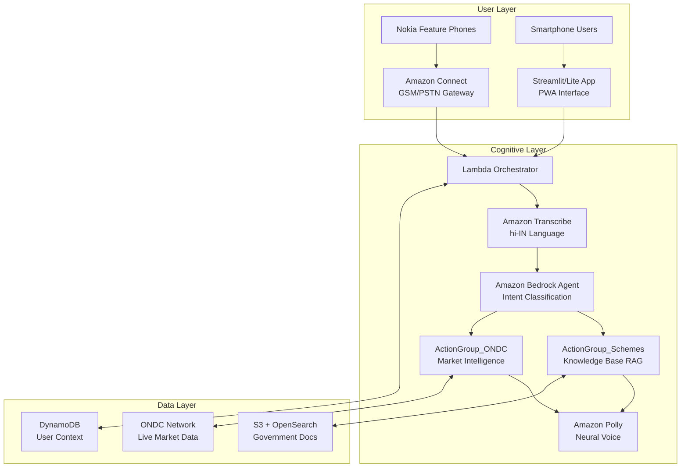

# Vaani-Sahayak 🎙️

**A Hybrid Omni-Channel Voice Assistant for Rural India**

Vaani-Sahayak is an AI-powered voice assistant designed specifically for rural farmers and villagers in India. Built on a three-pillar architecture, it provides intelligent agricultural assistance through advanced RAG-based scheme intelligence and real-time ONDC market intelligence, accessible via both Nokia feature phones and smartphones.

## 🏗️ Three-Pillar Architecture

### Pillar 1: Hybrid Interface
- **GSM/PSTN Telephony**: Amazon Connect integration for Nokia feature phones
- **Streamlit/Lite App**: Lightweight smartphone application for enhanced user experience
- **Universal Voice Entry**: Seamless speech-to-text processing regardless of device type

### Pillar 2: Scheme Intelligence (RAG)
- **Bedrock Knowledge Bases**: Advanced retrieval-augmented generation for government scheme information
- **S3 Document Repository**: Comprehensive storage of government PDF documents and eligibility criteria
- **Auto-enrollment Capability**: Intelligent slot-filling for scheme applications and form generation

### Pillar 3: ONDC Market Intelligence (Real-time APIs)
- **ONDC Buyer App (BAP)**: Integration as a certified ONDC Buyer Application Platform
- **Real-time Price Discovery**: Live Mandi prices and market intelligence through ONDC search protocols
- **Farmer-Buyer Matching**: Direct connection between farmers and wholesalers via ONDC select APIs

## 🎯 Key Features

- **Multi-Channel Access**: Works on both Nokia feature phones (via calls) and smartphones (via Streamlit app)
- **Hindi Language Support**: Natural conversation in Hindi with rural dialect understanding
- **Government Scheme Assistance**: RAG-powered information retrieval and application support
- **Real-time Market Prices**: Live ONDC integration for current Mandi prices and buyer connections
- **Context-Aware Responses**: Remembers user preferences and conversation history
- **Rural-Optimized**: Designed for low bandwidth and intermittent connectivity
- **Gram-Didi Persona**: Empathetic rural village sister personality for user comfort

## 🚀 Getting Started

### Prerequisites

- Python 3.9+
- AWS Account with appropriate permissions
- ONDC Network Gateway access (for market intelligence)
- Amazon Connect instance (for phone integration)

### Installation

1. Clone the repository:
```bash
git clone https://github.com/Karthikeya-man/Vaani-Sahayak.git
cd Vaani-Sahayak
```

2. Install dependencies:
```bash
pip install -r requirements.txt
```

3. Configure AWS credentials:
```bash
aws configure
```

4. Set up environment variables:
```bash
cp .env.example .env
# Edit .env with your configuration
```

### Quick Start

1. **Deploy Infrastructure**:
```bash
cdk deploy
```

2. **Run Streamlit App**:
```bash
streamlit run app.py
```

3. **Test with Sample Audio**:
```bash
python test_audio_processing.py
```

## 📋 Implementation Plan

The project follows a structured implementation plan with 15 major tasks covering:

1. **Core Infrastructure**: Lambda Orchestrator and Bedrock Agent setup
2. **Action Groups**: Scheme Intelligence and ONDC Market Intelligence
3. **Channel Integration**: Nokia PSTN and Streamlit app interfaces
4. **Testing**: Comprehensive unit and property-based testing
5. **Deployment**: AWS CDK infrastructure and monitoring

See [tasks.md](.kiro/specs/vaani-sahayak/tasks.md) for the complete implementation roadmap.

## 🏛️ Architecture



## 📚 Documentation

- **[Requirements](/.kiro/specs/vaani-sahayak/requirements.md)**: Detailed functional requirements and acceptance criteria
- **[Design Document](/.kiro/specs/vaani-sahayak/design.md)**: Technical architecture and implementation details
- **[Implementation Tasks](/.kiro/specs/vaani-sahayak/tasks.md)**: Step-by-step development roadmap
- **[API Documentation](docs/api.md)**: Service interfaces and data models
- **[Deployment Guide](docs/deployment.md)**: Infrastructure setup and configuration

## 🧪 Testing

The project includes comprehensive testing:

- **Unit Tests**: Specific functionality and edge cases
- **Property-Based Tests**: Universal correctness properties using Hypothesis
- **Integration Tests**: End-to-end system validation
- **Performance Tests**: Rural connectivity and latency optimization

Run tests:
```bash
pytest tests/
python -m pytest tests/ --hypothesis-show-statistics
```

## 🤝 Contributing

We welcome contributions! Please see [CONTRIBUTING.md](CONTRIBUTING.md) for guidelines.

### Development Workflow

1. Fork the repository
2. Create a feature branch: `git checkout -b feature/amazing-feature`
3. Make your changes and add tests
4. Ensure all tests pass: `pytest`
5. Commit your changes: `git commit -m 'Add amazing feature'`
6. Push to the branch: `git push origin feature/amazing-feature`
7. Open a Pull Request

## 📄 License

This project is licensed under the MIT License - see the [LICENSE](LICENSE) file for details.

## 🌟 Acknowledgments

- **Rural India**: For inspiring this project to bridge the digital divide
- **AWS**: For providing the cloud infrastructure and AI services
- **ONDC**: For enabling direct farmer-buyer connections
- **Open Source Community**: For the tools and libraries that make this possible

## 📞 Support

- **Issues**: [GitHub Issues](https://github.com/Karthikeya-man/Vaani-Sahayak/issues)
- **Discussions**: [GitHub Discussions](https://github.com/Karthikeya-man/Vaani-Sahayak/discussions)
- **Email**: support@vaani-sahayak.com

## 🗺️ Roadmap

- [ ] **Phase 1**: Core voice processing and basic scheme information
- [ ] **Phase 2**: ONDC integration and market intelligence
- [ ] **Phase 3**: Advanced slot-filling and form generation
- [ ] **Phase 4**: Multi-language support and regional dialects
- [ ] **Phase 5**: Mobile app and offline capabilities

---

**Made with ❤️ for Rural India**

*Empowering farmers and villagers with AI-powered assistance in their native language*